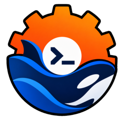

# rdsh — a fast, safe Rust launcher for `dsh`

[](https://github.com/sahenjp/rustdsh/actions/workflows/ci.yml)
[](https://github.com/sahenjp/rustdsh/actions/workflows/dashboard.yml)
[](https://github.com/sahenjp/rustdsh/actions/workflows/docs.yml)
[](https://github.com/sahenjp/rustdsh/releases)
[](LICENSE)
[](https://www.rust-lang.org/)

[日本語版](README.ja.md)

`rdsh` is a drop-in fast path for [dsh](https://github.com/deepseek-ai/deepseek-harness)
(the DeepSeek Harness CLI). Instead of a full rewrite, it **ports only the hot paths
to Rust and delegates everything else to the original `dsh` binary** — so you get
~98x faster startup and ~1/23rd the memory with zero behavior change.

- Startup median **~0.90ms** (original `dsh`: ~88ms)
- Resident memory **~2.9MB** (original: ~66MB), single ~806KB binary, no runtime tree
- Safe by construction: agent loop and profile boot are never reimplemented,
  delegation is a verbatim `exec`, and every optimization is output-identical

## Contents

- [Benchmarks](#benchmarks)
- [Install](#install)
- [Usage](#usage)
- [Replacement mode (run as `dsh`)](#replacement-mode-run-as-dsh)
- [Using with Smart-DSH](#using-with-smart-dsh)
- [Web dashboard](#web-dashboard)
- [Safety design](#safety-design)
- [How it got fast](#how-it-got-fast)
- [Project layout](#project-layout)
- [Contributing](#contributing)
- [Community](#community)
- [FAQ](#faq)
- [Credits](#credits)
- [License](#license)

## Benchmarks

Measured on Linux x86_64, including before/after comparisons for the optimizations.

| Case | rdsh | Baseline | Factor |
| --- | --- | --- | --- |
| `--version` startup (median, n=5) | ~0.90ms | original `dsh` ~88ms | ~98x |
| `--version` peak RSS | ~2.9MB | original ~66MB | ~1/23 |
| Hook-equivalent peak RSS | ~2.7MB | equivalent Node script ~45MB | ~1/16 |
| search (300 files, ~600k lines) | ~17ms | before ~41ms | ~2.4x |
| tokens (9.6MB text) | ~12ms | before ~35ms | ~2.9x |
| sessions --tokens (20 sessions) | ~0.41s | before ~1.65s | ~4.0x |
| Distribution size | one ~806KB binary | ~508MB Node tree | — |

Reproduce with `rdsh bench --n 5` and `/usr/bin/time -v`. The before/after
binaries were built from HEAD vs. the working tree in a scratch worktree and
their outputs were diffed for equality.

## Install

Fastest (prebuilt binary, no Rust needed):

```sh
# Linux / macOS / WSL
curl -fsSL https://github.com/sahenjp/rustdsh/releases/latest/download/install.sh | bash -s -- --from-release
```

```powershell
# Windows (PowerShell)
$f = Join-Path $env:TEMP 'rdsh-install.ps1'
Invoke-WebRequest -Uri https://github.com/sahenjp/rustdsh/releases/latest/download/install.ps1 -OutFile $f -UseBasicParsing
& $f -FromRelease
```

From source:

```sh
git clone https://github.com/sahenjp/rustdsh.git
cd rustdsh
./install.sh                 # build + install to ~/.local/bin/rdsh
./install.sh --as-dsh        # also shadow `dsh` (original kept as dsh-orig)
./install.sh --restore       # undo the shadowing
./install.sh --prefix=DIR    # custom install dir (default ~/.local/bin)
```

install.sh covers Linux, macOS, and WSL (auto-detects WSL, auto-installs
Rust via rustup unless `--no-rustup`). Native Windows uses install.ps1:

```powershell
git clone https://github.com/sahenjp/rustdsh.git
cd rustdsh
.\install.ps1              # build + install to %LOCALAPPDATA%\rdsh\bin (+ user PATH)
.\install.ps1 -AsDsh       # also shadow `dsh` (original kept as dsh-orig)
.\install.ps1 -Restore     # undo the shadowing
.\install.ps1 -Wsl         # also install inside WSL via install.sh
```

| OS | script | notes |
| --- | --- | --- |
| Linux / macOS | `./install.sh` | needs `cargo` or `curl` (rustup auto-install) |
| WSL | `./install.sh` inside the distro | detected automatically; alongside native via `install.ps1 -Wsl` |
| Windows (native) | `.\install.ps1` | needs Rust (`winget install Rustlang.Rustup`); MSVC build tools required to compile |

First boot with no model connected prints a pointer instead of leaving
you at the DeepSeek prompt: run `rdsh setup` (or `rdsh setup --login` to
start the Codex/opencode OAuth flow right away).

Or build directly: `cargo build --release` produces `target/release/rdsh`.
Requires Rust 1.73+ (uses `u32::div_ceil`, `thread::scope`); only three
dependencies (`clap`, `serde_json`, `anyhow`), no async runtime, no build scripts.

## Usage

### dsh-compatible delegation

```sh
rdsh tui                          # same as: dsh --profile tui (with slim env)
rdsh --profile web --patch x.yml  # boot with an extra overlay
rdsh --passthrough tui           # byte-identical delegation, no slim env
rdsh --dry-run tui -- --resume abc  # print what would be executed
```

### Native fast commands (no Node startup)

```sh
rdsh tokens ./AGENTS.md               # estimate input tokens (~4 chars = 1, CJK = 1 each)
echo ... | rdsh prune --max-tokens 4000  # keep head+tail within a token budget
rdsh search TODO --dir . --max 100   # recursive grep (parallel, same order as sequential)
rdsh search-web "rust async" --limit 5  # web search via SearXNG (default http://127.0.0.1:8888, $SEARXNG_URL wins)
rdsh compact ./s.jsonl --max-tokens 8000 # compact a session transcript (source untouched)
rdsh sessions --limit 20 --tokens    # list sessions with decompressed token estimates
rdsh logs --tail 50 --grep ERROR     # inspect startup logs
rdsh profiles / rdsh skills          # list profiles and skills
rdsh doctor                          # check original dsh, DSH_HOME, slim setup
rdsh bench --n 5                     # compare rdsh vs dsh startup
rdsh serve                           # local web dashboard (:3080)
```

### `rdsh auth`: OAuth auto-recognition (drop it in and it works)

Logins you already did elsewhere are mirrored into
`$DSH_HOME/.credentials.yaml`, the credential store dsh itself reads:

- Codex CLI (`~/.codex/auth.json`, ChatGPT OAuth)
- opencode (`$XDG_DATA_HOME/opencode/auth.json`, e.g. `openai` OAuth
  becomes the `openai-codex` route)

```sh
rdsh auth            # status: what was found, what dsh already recognizes
rdsh auth --import   # write missing/older grants (0600, other entries untouched)
rdsh auth --json     # machine-readable status
rdsh setup           # first-run wizard: import, DeepSeek-key paste, --login/--open
rdsh setup --web     # floating glass setup UI on localhost (browser auto-opens)
```

`setup --web` は起動ごとに鍵を発行し、`#key=...` を含む URL を表示します。
ブラウザーで開くと鍵はそのタブに保存されます。API キーの保存と画面の終了には
この鍵が必要です。接続状態の読み取りにも同じ鍵が必要です。
端末に表示された URL を他人と共有しないでください。

Booting (`rdsh tui`, `dump-config`, `plugin`) auto-syncs first, so logging
in with Codex/opencode is enough. `RDSH_AUTH_AUTOSYNC=0` disables it.
A dsh-side token that is newer is never overwritten, and non-grant
records (API keys) are left alone.

### `rdsh guard`: a fast hook command for hooks.json

`guard` scans stdin (hook JSON or raw text) for deny patterns and blocks on
match: exit code 2 with the reason on stderr, exit 0 otherwise. With `--json`
it prints `{"decision":"block"}` / `{"decision":"approve"}` instead. `*` in a
pattern matches any string. At ~1ms startup and ~3MB RSS, per-tool-call hook
cost is effectively zero.

```sh
echo "$input" | rdsh guard --deny "rm -rf /*" --deny "*token*"
```

```json
{
  "hooks": {
    "PreToolUse": [
      { "matcher": "Bash", "hooks": [{ "type": "command", "command": "rdsh guard --deny \"rm -rf /*\"" }] }
    ]
  }
}
```

This follows the dsh hook protocol: exit 2 blocks with a message the model sees,
any other failure is non-blocking and only logged.

## Replacement mode (run as `dsh`)

When the binary is invoked under the name `dsh`, anything that is not an
rdsh-native subcommand is delegated verbatim to the original binary, so
`dsh --version`, `dsh --profile tui`, and `dsh --help` stay byte-identical.

- Original-binary discovery order: `RDSH_ORIG_BIN` (legacy `DSH_ORIG_BIN` still
honored) → `~/.config/rdsh/origin` →
  sibling backups (`dsh-orig`, `dsh.orig`, `dsh.real`) → `PATH` (self excluded) →
  newest `~/.local/opt/node-v*` tree matching this OS/CPU
- Naming follows dsh convention: kebab-case commands/flags like the original
  (`dump-config`, `--from-default-profile`), while the `DSH_` env namespace stays
  owned by dsh itself — rdsh-private keys live under `RDSH_`
- One-shot escapes: `RDSH_PASSTHROUGH=1 dsh ...` (no slim env),
  `RDSH_DRY_RUN=1 dsh ...` (print only)
- Slim also sets `NODE_COMPILE_CACHE` (Node >= 22.1 only, user value wins,
  `RDSH_NODE_COMPILE_CACHE=0` opts out). Upstream dsh reads no `RDSH_*` key.
- Default profile: `RDSH_DEFAULT_PROFILE`, then local `tui`, else a guided error
  (dsh 0.2.0 ships no `tui` template)
- Name shadowing: a bare `dsh tokens` runs the rdsh subcommand; a profile
  literally named `tokens` still boots via `dsh --profile tokens`
- Node wrappers: scripts that run `node "$(... dsh ...)"` break while `dsh` is
  shadowed (the path is now a native binary, not JS). Exec `dsh`/`rdsh`
  directly instead of via `node`; `rdsh doctor` lists the offending wrappers.

## Using with Smart-DSH

[Smart-DSH](https://github.com/hikarioyama/Smart-DSH) is a DSH web-profile
plugin bundle (mobile UI, Web Push notifications, Esc-to-stop), not a competing
binary — it coexists with rdsh. rdsh passes its setup commands through:

```sh
rdsh doctor                                    # also shows dsh version + Smart-DSH bundles
rdsh --profile web --dump-config | grep notify-push   # verify composition (read-only)
rdsh plugin --profile web add /path/to/dsh-notify-push  # same as dsh plugin ...
rdsh --profile web                             # boot web with slim env (plugins unaffected)
```

Co-use notes:

- Ports: the dsh web GUI and `rdsh serve` both default to 3080. Keep 3080 for
  dsh web (push/remote access) and run `rdsh serve --port 38080`.
- `dsh`-shadowing: with `install.sh --as-dsh`, Smart-DSH helper scripts that
  locate DSH via `dsh` on PATH resolve to the Rust binary and fail. Run those
  scripts against the original (`dsh-orig ...`) or export `DSH_PACKAGE_DIR`
  to the DSH package dir.
- Versions: Smart-DSH documents DSH `0.1.2-rc.1`; `rdsh doctor` prints your
  actual dsh version so mismatches are visible before installing bundles.

## Web dashboard

```sh
rdsh serve
# open the URL containing #key=... printed by rdsh (localhost only)
# if the port is taken (the dsh web GUI also uses 3080), try --port 38080
```

| API | Purpose |
| --- | --- |
| `GET /api/version` | version |
| `GET /api/doctor` | health check |
| `POST /api/tokens` | token estimate for `{"text"}` |
| `POST /api/prune` | prune `{"text","max_tokens"}` to budget |
| `GET /api/bench?n=3` | startup measurement |
| `GET /api/sessions?limit=20` | recent sessions |
| `GET /api/skills`, `/api/profiles` | name lists |

`/api/version` 以外の API は起動ごとの鍵を `X-RDSH-Token` ヘッダーで要求します。
ブラウザー画面は表示された URL の鍵を使います。HTTP は本文を最大 64 KiB まで
読み取り、同時接続を 32 件に制限します。画面は CDN を使わずオフラインで動作します。

Which dashboard? `rdsh serve` is the quick local status page for this
machine. For project metrics, human Q&A, and phone access, use the optional
[Node.js dashboard](dashboard/README.md) instead.

### Which dashboard should I use? (`rdsh serve` vs `dashboard/`)

- Use `rdsh serve` for a quick local check of this machine
  (version, doctor, tokens, sessions). No setup beyond the `rdsh` binary.
- Use `dashboard/` for project work: metrics, tasks, human Q&A,
  and phone access via Tailscale QR. It needs Node.js 22+.
  See the [Node.js dashboard guide](dashboard/README.md).
- If port 3080 is taken by the dsh web GUI, keep 3080 for dsh web
  and run `rdsh serve --port 38080`.

### Private project dashboards and phone access

The optional [Node.js dashboard](dashboard/README.md) adds project metrics,
tasks, human questions/replies, native MCP Events for ChatGPT Dots, and Tailscale
QR access. `rdsh-dashboard project --project <directory>` opens a project-specific
dashboard; `rdsh-dashboard harness` starts a separate original Harness Web UI.
See the guide for installation, MCP client configuration, and private Dots
connections through Secure MCP Tunnel. Requires Node.js 22+.

## Safety design

1. The agent loop and profile boot are never reimplemented — delegation only.
2. Slim mode only *adds* environment variables; unknown keys are ignored upstream.
3. Launcher error cases from the original (`desktop` profile, mutually exclusive
dumps, missing `--profile`) are reproduced in Rust.
4. Read paths never write: tokens/search/compact/dump/native APIs touch nothing.
5. Instant retreats: `--passthrough`, `RDSH_PASSTHROUGH=1`, `./install.sh --restore`.

### Verification (all executed)

- `cargo test`: 26 unit tests pass (token math, wildcard matcher, arg splitter, auth splice/freshness, setup lang).
  The suite caught and fixed one real matcher bug (single-pattern substring).
- `tests/regress.sh`: 35 CLI checks pass (every subcommand, error paths,
  auth import round-trip, setup first-run flow, and sandboxed `dsh`-name
  delegation against a fake original).
- Optimization diffs: old vs. new binary outputs compared byte-for-byte
  (300-hit search and truncated-max search both identical).
- Live replacement verified on a real machine: `dsh --version` still delegates,
  new native commands work under the `dsh` name.

## How it got fast

- ASCII fast path for token estimation: pure-ASCII input is one `len/4`
  computation (non-ASCII keeps the exact scan; results identical).
- Two-phase search: sequential walk fixes the order, files are grepped in
  parallel, hits merge back in walk order. Trees under 32 files keep the exact
  old sequential code path.
- Parallel zstd expansion for `sessions --tokens` (same numbers, order kept).
- Release profile stays small: `opt-level=z`, LTO, `strip`, `panic=abort` (~806KB).

## Project layout

- `src/main.rs` — CLI definition, dispatch, `dsh`-name detection
- `src/auth.rs` — OAuth auto-recognition (codex/opencode → credentials.yaml)
- `src/dsh_args.rs` — original `lib/bin.js`-compatible arg splitter (read-only)
- `src/passthrough.rs` — original-binary discovery + `exec` delegation
- `src/slim.rs` — slim environment definition
- `src/tokens.rs` — token estimation and pruning
- `src/search.rs` — order-preserving parallel grep
- `src/websearch.rs` — SearXNG web search (`search-web`, no API key)
- `src/compact.rs` — session transcript compaction
- `src/inspect.rs` — read-only sessions/logs/skills/profiles views
- `src/guard.rs` — hooks.json guard command
- `src/serve.rs` + `src/ui.html` — local web dashboard
- `src/setup_web.rs` + `src/setup.html` — floating glass setup UI (`setup --web`)
- `install.sh` — installer (`--as-dsh` shadow / `--restore`)
- `tests/regress.sh` — CLI regression suite (35 checks)

## Community

- Start with [CONTRIBUTING.md](CONTRIBUTING.md) (4-line PRs, screenshot rules).
- Bugs and ideas: [issue forms](https://github.com/sahenjp/rustdsh/issues/new/choose) (Japanese OK).
- Questions: [Issues](https://github.com/sahenjp/rustdsh/issues).
- Security: never file public issues — see [SECURITY.md](SECURITY.md).
- Design docs: [docs/ARCHITECTURE.md](docs/ARCHITECTURE.md) ·
  [docs/BENCHMARKS.md](docs/BENCHMARKS.md) · [docs/ROADMAP.md](docs/ROADMAP.md) ·
  [docs/RELEASING.md](docs/RELEASING.md) · [CHANGELOG.md](CHANGELOG.md).
- Improvement index: [issue #74](https://github.com/sahenjp/rustdsh/issues/74)
  maps all 72 proposals to feature issues with priority (P0-P3).
- Be kind: [Code of Conduct](CODE_OF_CONDUCT.md).

## Contributing

```sh
cargo fmt --check      # must be clean
cargo clippy --all-targets -- -D warnings   # must be clean
cargo test             # 26 unit tests
BIN=./target/debug/rdsh sh tests/regress.sh # 35 CLI checks (needs cargo build first)
```

No new dependencies without discussion: binary size and startup time are
features. Behavior changes must extend `tests/regress.sh`.

Release: `git tag vX.Y.Z && git push origin vX.Y.Z` builds per-OS binaries
(Linux/macOS/Windows) and attaches them to the GitHub Release via the `cd`
workflow.

## FAQ

- **Port 3080 is busy?** The dsh web GUI uses it too — run `rdsh serve --port 38080`.
- **A profile collides with a subcommand name?** Boot it explicitly:
  `dsh --profile <name>`.
- **Revert the replacement?** `./install.sh --restore` brings the original back.
- **What does `~123tok?` mean?** Without the `zstd` CLI the estimate falls back
  to compressed-bytes/4; the `?` marks that.

## Credits

Ideas: [@studio_yebisu](https://x.com/studio_yebisu), [@remydre8](https://x.com/remydre8).

## License

MIT — see [LICENSE](LICENSE).
