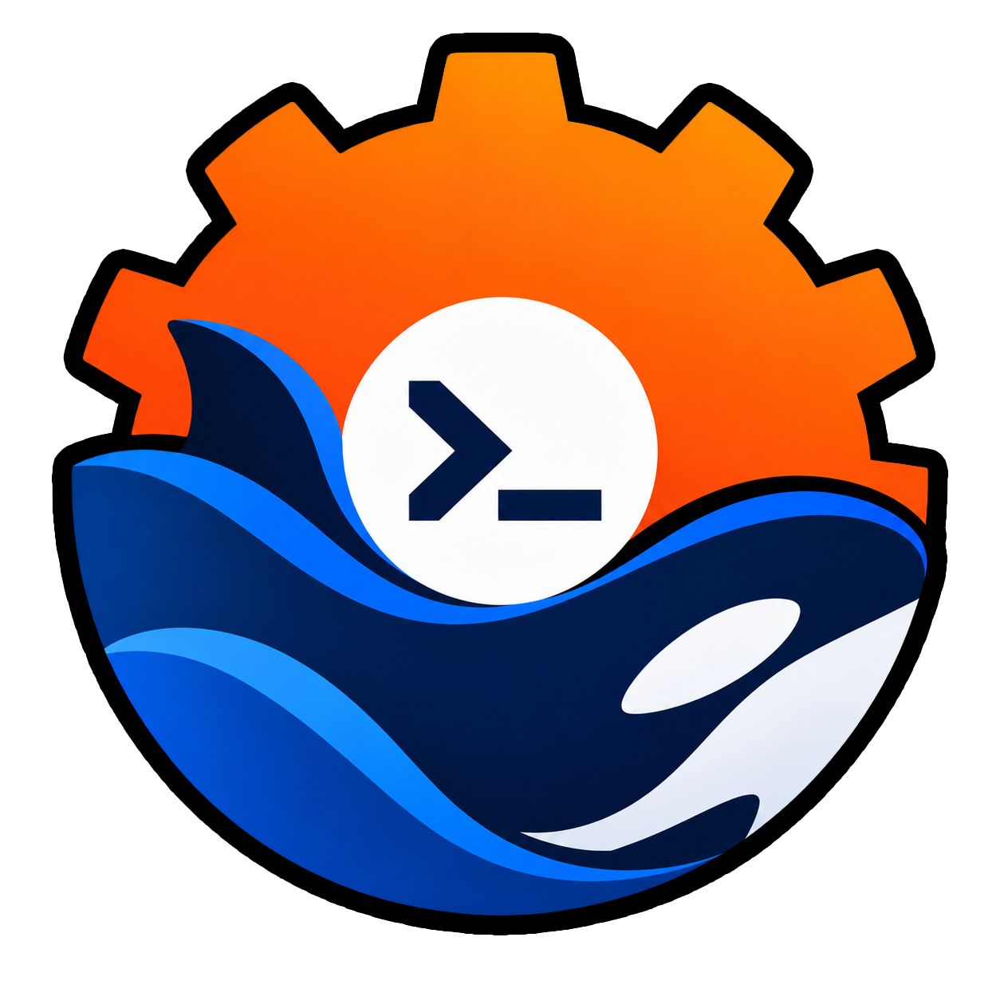

# rdsh — a fast Rust launcher for DeepSeek Harness

[](https://github.com/jimoto-no-llm/rustdsh/actions/workflows/ci.yml)
[](https://github.com/jimoto-no-llm/rustdsh/actions/workflows/dashboard.yml)
[](https://github.com/jimoto-no-llm/rustdsh/actions/workflows/docs.yml)
[](https://github.com/jimoto-no-llm/rustdsh/releases)
[](LICENSE)
[](https://www.rust-lang.org/)

[Japanese version](README.ja.md)

An independent community project; not an official DeepSeek or DeepSeek Harness project.

`rdsh` is a drop-in fast path for [dsh](https://github.com/deepseek-ai/deepseek-harness)
(the DeepSeek Harness CLI). Instead of rewriting everything, it ports only
the hot paths to Rust and delegates conversations and model runs to the
original `dsh` binary. Arguments you already use keep working as-is.

**Moving from Claude Code or Codex to DSH?**
The [migration guide](docs/CODING-AGENTS.md) takes you from installation and model
connection to your first DSH conversation in your existing project. Keep your
`AGENTS.md` / `CLAUDE.md`; standard DSH profiles already read them.

## Why rdsh?

- Fast startup, small footprint. In the [2026-10-10 measurement](docs/evidence/ux-performance-20261010/README.md), `--version` took 0.91 ms median with 2.75 MB peak RSS on Linux/WSL x86_64 (original `dsh`: 73 ms and 68 MB). These short CLI calls do not describe the resident Desktop app or model calls.
- Drop-in compatible. Anything that is not an rdsh-native subcommand is passed to the original binary unchanged, so existing scripts keep running.
- Useful native commands. Token estimates, search, compaction, session listing, and health checks run without starting Node.
- Safe by default. Read paths never write, server features stay off until enabled, and agent tools run under mandatory isolation on supported Linux.

## Getting started

Install using the commands below. Conversations also need the original DSH;
the [migration guide](docs/CODING-AGENTS.md#1-install-rdsh-and-the-original-dsh)
shows its pinned installation. Then verify the installation:

```sh
rdsh --version
rdsh doctor
```

To reuse a Codex ChatGPT login, run `rdsh auth --import --provider openai-codex --source codex`.
Then start DSH in a project with a `README.md`:

```sh
cd /absolute/path/to/your/project
rdsh --share-file README.md --profile web
```

In DSH, open **Settings → Models** to add the provider and API key (or imported Codex OAuth).
Choose the same project in **Choose workspace**, press **New Session**, select
its model and confirm a reply.
The [migration guide](docs/CODING-AGENTS.md) includes the pinned DSH install,
login import, instruction reuse and recovery steps. The Web profile initializes
on first use; `rdsh tui` requires an installed `tui` profile.

Protected conversations currently require Linux x86_64 (WSL on Windows), original
DSH, Node.js, bubblewrap and prlimit. Model tools inspect explicitly shared files
read-only; full code editing and project test execution are not supported yet.
Native CLI tools remain usable without DSH: `printf 'hello rdsh\n' | rdsh tokens`
(PowerShell: `"hello rdsh" | rdsh tokens`).

## Requirements

| Item | Detail |
| --- | --- |
| OS | Linux, macOS, WSL, Windows (native). Agent isolation needs Linux x86_64 + bubblewrap + prlimit. |
| DSH runtime | Required only for DSH conversations, not local text tools or the project MCP dashboard. Audited versions: 0.2.0-rc.2, 0.2.1-alpha.1. |
| Rust | 1.85+ (source builds only). Prebuilt binaries need no Rust. |
| Optional | Node.js 22+ for the [Node.js dashboard](dashboard/README.md); SearXNG for `search-web`; `zstd` CLI for bounded decompression of sessions whose frame headers omit content size. |

## Install

Fastest (prebuilt binary, no Rust needed):

```sh
# Linux / macOS / WSL
curl -fsSL https://github.com/jimoto-no-llm/rustdsh/releases/latest/download/install.sh | bash -s -- --from-release
```

```powershell
# Windows (PowerShell)
$f = Join-Path $env:TEMP 'rdsh-install.ps1'
Invoke-WebRequest -Uri https://github.com/jimoto-no-llm/rustdsh/releases/latest/download/install.ps1 -OutFile $f -UseBasicParsing
& $f -FromRelease
```

From source:

```sh
git clone https://github.com/jimoto-no-llm/rustdsh.git
cd rustdsh
./install.sh                 # build + install to ~/.local/bin/rdsh
./install.sh --as-dsh        # also shadow `dsh` (original kept as dsh-orig)
./install.sh --restore       # undo the shadowing
./install.sh --prefix=DIR    # custom install dir (default ~/.local/bin)
```

`install.sh` covers Linux, macOS, and WSL (auto-detects WSL, installs Rust
via rustup unless `--no-rustup`). Native Windows uses `install.ps1`:

```powershell
git clone https://github.com/jimoto-no-llm/rustdsh.git
cd rustdsh
.\install.ps1              # build + install to %LOCALAPPDATA%\rdsh\bin (+ user PATH)
.\install.ps1 -AsDsh       # also shadow `dsh` (original kept as dsh-orig)
.\install.ps1 -Restore     # undo the shadowing
.\install.ps1 -Wsl         # also install inside WSL via install.sh
```

| OS | Script | Notes |
| --- | --- | --- |
| Linux / macOS | `./install.sh` | Needs `cargo` or `curl` (rustup auto-install). |
| WSL | `./install.sh` inside the distro | Detected automatically; alongside native via `install.ps1 -Wsl`. |
| Windows (native) | `.\install.ps1` | Needs Rust (`winget install Rustlang.Rustup`); MSVC build tools required to compile. |

First boot with no model connected prints a setup pointer instead of leaving
you at the DeepSeek prompt: run `rdsh setup` (or `rdsh setup --login` to
start the Codex/opencode OAuth flow right away). Direct builds use
`cargo build --release` (produces `target/release/rdsh`).

## Usage

### dsh-compatible delegation

```sh
rdsh tui                          # same as: dsh --profile tui (with slim env)
rdsh --profile web --patch x.yml  # boot with an extra overlay
rdsh --passthrough tui            # no slim env; tool isolation remains
rdsh --dry-run tui -- --resume abc  # print what would be executed
```

Slim mode only adds environment variables; unknown keys are ignored
upstream. `--passthrough` toggles environment tuning and never disables
tool isolation. Details: [docs/ARCHITECTURE.md](docs/ARCHITECTURE.md).

### Native fast commands (no Node startup)

```sh
rdsh tokens ./AGENTS.md                # estimate input tokens (~4 chars = 1, CJK = 1 each)
echo ... | rdsh prune --max-tokens 4000  # keep head+tail within a token budget
rdsh search TODO --dir . --max 100    # recursive grep (parallel, same order as sequential)
rdsh compact ./s.jsonl --max-tokens 8000  # compact a session transcript (source untouched)
rdsh sessions --limit 20 --tokens     # list sessions with token estimates
rdsh logs --tail 50 --grep ERROR      # inspect startup logs
rdsh profiles / rdsh skills           # list profiles and skills
rdsh doctor                           # check original dsh, DSH_HOME, slim setup
rdsh bench --n 5                      # compare rdsh vs dsh startup
```

### Credentials: explicit import only

`rdsh auth --import --provider openai-codex` mirrors a login you already
did elsewhere into `$DSH_HOME/.credentials.yaml`, the store dsh itself reads:

- Codex CLI (`~/.codex/auth.json`, ChatGPT OAuth)
- opencode (`$XDG_DATA_HOME/opencode/auth.json`)

```sh
rdsh auth            # status: what was found, what dsh already recognizes
rdsh auth --import --provider openai-codex   # write missing/older grants only (0600, others untouched)
rdsh auth --json     # machine-readable status
rdsh setup           # inspect model setup and show explicit login/import steps
rdsh setup --web     # localhost setup UI (browser auto-opens, per-launch #key=... URL)
```

Boot, diagnostics, and setup never copy other apps credentials on their own.
Pick OAuth with `--source codex` or a key with `--ref OPENAI_API_KEY`.
Bulk import and `RDSH_AUTH_AUTOSYNC` are disabled.

### Optional extras (off by default)

Server-type features stay off until enabled, so a plain install remains
a fast dsh:

```sh
rdsh settings set extras.enable serve,search-web
rdsh settings get extras.enable
```

| Extra | Command | Notes |
| --- | --- | --- |
| `serve` | `rdsh serve` (default :38080) | Local status page, localhost only, per-launch key. |
| `search-web` | `rdsh search-web "query" --limit 5` | Needs SearXNG. |

`rdsh serve` never collides with the dsh web GUI (:3080); `--port 0`
picks a free port. API and dashboard details: [Web dashboard](#web-dashboard).

### Agent tool isolation

On Linux x86_64 with bubblewrap, prlimit, and an audited DSH, model tools are
limited to `rdsh_inspect`. Only copies of files you explicitly share are
mounted read-only; network and writes to host/project are denied at the kernel
level, with no host credentials or environment passed through.

```sh
rdsh --share-file README.md --share-file src/main.rs --profile tui
```

Shared contents can reach the model, so never share secrets. Hidden files,
symlinks, and multiply linked files are refused. Unsupported platforms or DSH
versions fail closed instead of running unprotected. Plugins and profiles you
configured remain trusted code.

### Hook guard (`rdsh guard`)

`guard` scans stdin (hook JSON or raw text) for `--deny` patterns:
exit 2 blocks with a reason, exit 0 passes. `--json` prints
`{"decision":"block"}` or `{}`. A miss is not an approval; the host
must still enforce permissions. `*` matches any string. Guard is a short native
CLI invocation; its cost depends on the input and machine.

```sh
echo "$input" | rdsh guard --deny "rm -rf /*" --deny "*token*"
```

```json
{
  "hooks": {
    "PreToolUse": [
      { "matcher": "Bash", "hooks": [{ "type": "command", "command": "rdsh guard --deny \"rm -rf /*\"" }] }
    ]
  }
}
```

Context generation never pulls session history automatically; use the explicit
`rdsh context search`. On Unix, context and recursive search open files
relative to a directory handle and refuse symlink swaps, hard links, and
special files. On Windows, native search is refused until a safe implementation
lands. This follows the dsh hook protocol: exit 2 blocks with a message the
model sees, other failures only log.

## Replacement mode (run as `dsh`)

When invoked as `dsh`, anything that is not an rdsh-native subcommand
(`tokens`, `guard`, `serve`, `sessions`, and so on) is delegated
verbatim to the original binary, so `dsh --version`, `dsh --profile tui`,
and `dsh --help` stay byte-identical.

- One-shot escapes: `RDSH_PASSTHROUGH=1 dsh ...` (no slim env), `RDSH_DRY_RUN=1 dsh ...` (print only).
- Default profile: `RDSH_DEFAULT_PROFILE`, then local `tui`, else a guided error.
- A profile literally named `tokens` still boots via `dsh --profile tokens`.
- Scripts that run `node "$(... dsh ...)"` break while shadowed; run `dsh`/`rdsh` directly. `rdsh doctor` lists affected wrappers.

## Using with Smart-DSH

[Smart-DSH](https://github.com/hikarioyama/Smart-DSH) is a DSH web-profile
plugin bundle (mobile UI, Web Push notifications, Esc-to-stop), not a competing
binary. It coexists with rdsh:

```sh
rdsh doctor                                    # also shows dsh version + Smart-DSH bundles
rdsh --profile web --dump-config | grep notify-push   # verify composition (read-only)
rdsh plugin --profile web add /path/to/dsh-notify-push  # same as dsh plugin ...
rdsh --profile web                             # boot web with slim env (plugins unaffected)
```

Ports never collide (dsh web GUI :3080, `rdsh serve` :38080). With
`install.sh --as-dsh`, point Smart-DSH helper scripts at `dsh-orig` or
export `DSH_PACKAGE_DIR`.

## Web dashboard

The [rdsh settings page](docs/RDSH-SETTINGS.md) keeps multiline drafts while typing,
shows unsaved changes, and confirms before discarding them on reload. Saving only
Discord preserves drafts in the other sections. Section navigation and a sticky
save bar are available on desktop and mobile; failed saves keep the input.
Setup and local tools explain what they change and offer recovery steps.
Project updates keep unchanged question controls in place, preserving focus and
the caret. [Real screens, edit/save GIF, and regression results](docs/evidence/ux-performance-20261010/README.md).

For the read-only workflow member board in DSH's conversation GUI, use the [verified source-patch preparation tool](plugins/workflow-board/README.md) with an isolated compatible source checkout. It includes the 18-file board/UI projection patch, compatibility diagnostics and fixture tests; building and adopting the patched DSH are separate steps.

```sh
rdsh settings set extras.enable serve  # replaces the enabled-extra list
rdsh serve
# open the URL containing #key=... printed by rdsh (localhost only)
```

| API | Purpose |
| --- | --- |
| `GET /api/version` | version (requires key) |
| `GET /api/doctor` | health check |
| `POST /api/tokens` | token estimate for `{"text"}` |
| `POST /api/prune` | prune `{"text","max_tokens"}` to budget |
| `GET /api/bench?n=3` | startup measurement |
| `GET /api/sessions?limit=20` | recent sessions |
| `GET /api/skills`, `/api/profiles` | name lists |

All APIs require the per-launch key in the `X-RDSH-Token` header (the
browser UI reads it from its URL). No CDN is used; the page works offline.

`rdsh serve` is the quick local status page. For project metrics, human
Q&A, and phone access, use the optional [Node.js dashboard](dashboard/README.md)
(needs Node.js 22+): `rdsh-dashboard project --project <directory>` or
`rdsh-dashboard harness` for the original Harness Web UI. On native Windows
the launcher can live in the tray (right-click Open / Exit,
double-click opens; `--no-tray` stays in the terminal).

The original Harness update banner appears right after an update is recorded,
every two hours from its update time, and on every full page reload.
Dismiss / X or a successful updater check closes the current occurrence; the
two-hour schedule continues. Unchanged release checks do not record a new update. Switching projects keeps it closed until the next slot, and close
events reach other GUI ports of the same OS user. Activating new code needs one
normal GUI restart/reload; see [browser verification](docs/evidence/update-notice-repeat/README.md).

## Benchmarks

Current checkout, measured on 2026-10-10 against `e81782a` on Linux/WSL x86_64:

| Case | Before | After | Before / after |
| --- | --- | --- | --- |
| Native `--version` (median, n=21) | 1.065 ms | 0.908 ms | 1.17x |
| ASCII prune (10 MiB, budget 4000, n=21) | 10.770 ms | 7.830 ms | 1.38x |
| No-match search (160 files, 960k lines, n=21) | 8.998 ms | 5.390 ms | 1.67x |
| Browser idle render + layout (n=21) | 30.50 ms | 0.40 ms | 76.3x |
| Browser metrics-only render + layout (n=21) | 28.90 ms | 3.30 ms | 8.8x |
| Release binary size | 1,956,552 bytes | 1,968,752 bytes | — |

The browser fixture contains 100 tasks, 40 questions and 30 events. It measures
rendering with synthetic data, not network latency, model execution or INP.
CLI outputs and visible browser data/drafts were checked for equality. Other
commands show small gains or slowdowns: the full table, raw samples, environment,
screenshots and reproduction are in the [dated evidence](docs/evidence/ux-performance-20261010/README.md).
These changes are included in v0.2.1; earlier v0.2.0 binaries do not include them.

### Historical Linux measurements

The earlier measurements below used different revisions, builds and workloads.
The 806 KB size is historical; the current release build is about 1.97 MB.

| Case | rdsh | Baseline | Factor |
| --- | --- | --- | --- |
| `--version` startup (median, n=5) | ~0.90 ms | original `dsh` ~88 ms | ~98x |
| `--version` peak RSS | ~2.9 MB | original ~66 MB | ~1/23 |
| Hook-equivalent peak RSS | ~2.7 MB | equivalent Node script ~45 MB | ~1/16 |
| search (300 files, ~600k lines) | ~17 ms | before ~41 ms | ~2.4x |
| tokens (9.6 MB text) | ~12 ms | before ~35 ms | ~2.9x |
| sessions --tokens (20 sessions) | ~0.41 s | before ~1.65 s | ~4.0x |
| Distribution size | one ~806 KB binary | ~508 MB Node tree | — |

Reproduce with `rdsh bench --n 5` and `/usr/bin/time -v`.
Details: [docs/BENCHMARKS.md](docs/BENCHMARKS.md). On a dense synthetic search
fixture the median went from 197.77 ms to 4.61 ms (Linux, fixture-specific);
see [measurement evidence](docs/evidence/performance-security-audit.md).
Source changes after v0.2.0 are not in that published release; check the
release notes before installing binaries.

## Safety design

1. The agent loop and profile boot are never reimplemented — delegation only.
2. Slim mode only adds environment variables; unknown keys are ignored upstream.
3. Launcher error cases from the original (`desktop` profile, mutually exclusive dumps, missing `--profile`) are reproduced in Rust.
4. Read paths never write: tokens/search/compact/dump/native APIs touch nothing.
5. `--passthrough` disables environment tuning. Restoring the original DSH with `./install.sh --restore` also removes rustdsh protection.

Verify the current checkout with `cargo test`, `tests/regress.sh`, and the
[required checks](CONTRIBUTING.md). Reproducible synthetic performance tests and
before/after output checks are in [BENCHMARKS.md](docs/BENCHMARKS.md).

## Documentation

| Doc | What it covers |
| --- | --- |
| [docs/USER-FLOW.md](docs/USER-FLOW.md) | Install to setup to use to recover. |
| [docs/CODING-AGENTS.md](docs/CODING-AGENTS.md) | Move from Claude Code / Codex: install, model connection, instructions and first conversation. |
| [docs/PROJECT-MCP.md](docs/PROJECT-MCP.md) | Optional project MCP setup and removal for existing clients. |
| [docs/ARCHITECTURE.md](docs/ARCHITECTURE.md) | Delegation, settings ownership, crate layout. |
| [docs/BENCHMARKS.md](docs/BENCHMARKS.md) | Reproducible measurements. |
| [docs/RDSH-SETTINGS.md](docs/RDSH-SETTINGS.md) | Settings UI and CLI keys. |
| [docs/ROADMAP.md](docs/ROADMAP.md) | Direction and backlog. |
| [docs/RELEASING.md](docs/RELEASING.md) | Release process. |
| [CHANGELOG.md](CHANGELOG.md) | Notable changes per release. |

## Community

- Start with [CONTRIBUTING.md](CONTRIBUTING.md) (4-line PRs, screenshot rules).
- Bugs and ideas: [issue forms](https://github.com/jimoto-no-llm/rustdsh/issues/new/choose) (Japanese OK).
- Questions: [Issues](https://github.com/jimoto-no-llm/rustdsh/issues).
- Security: never file public issues — see [SECURITY.md](SECURITY.md).
- Support: [SUPPORT.md](SUPPORT.md). Be kind: [Code of Conduct](CODE_OF_CONDUCT.md).

## FAQ

- Port is busy? The dsh web GUI uses 3080; `rdsh serve` defaults to 38080. Use `--port 0` for a free port.
- A profile collides with a subcommand name? Boot it explicitly: `dsh --profile <name>`.
- Revert the replacement? `./install.sh --restore` brings the original back.
- What does `~123tok?` mean? The unpacked size could not be determined, so the estimate uses compressed-bytes/4. Known-size zstd frame headers need no CLI; other frames need working bounded decompression.

## Credits

DeepSeek Harness provides the upstream runtime; without it, rustdsh would not exist.
Thanks to the upstream developers and everyone contributing code, reviews, tests, and ideas.

- Icon by [PENTACoXIAN](https://x.com/PENTACoXIAN)

- [GrEarl](https://github.com/GrEarl) and [PENTACoXIAN](https://x.com/PENTACoXIAN): security reports and review.
- [StudioYebisu](https://github.com/yebisu0529-ship-it), [RNA4219](https://github.com/RNA4219), and [eightman999](https://github.com/eightman999): contributions and improvement reports.
- [@remydre8](https://x.com/remydre8): ideas and product suggestions.

## License

MIT — see [LICENSE](LICENSE). Upstream DeepSeek Harness and its dependencies retain their own license terms.
