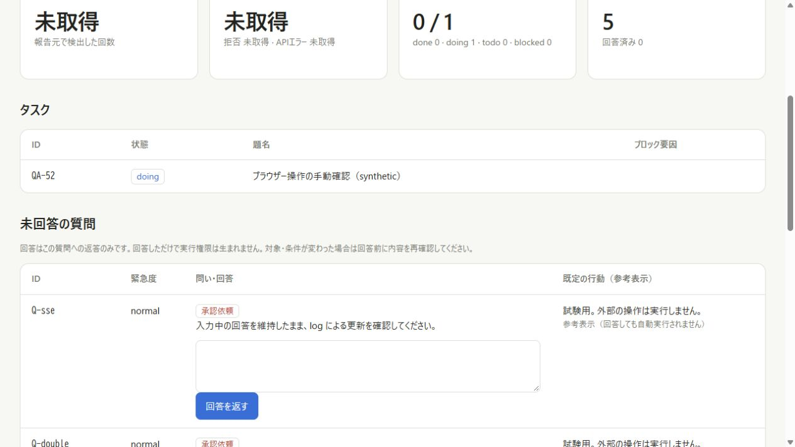
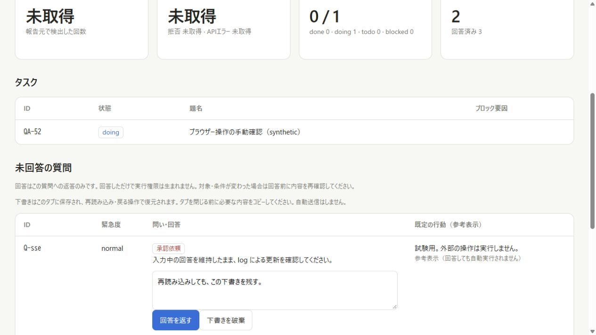
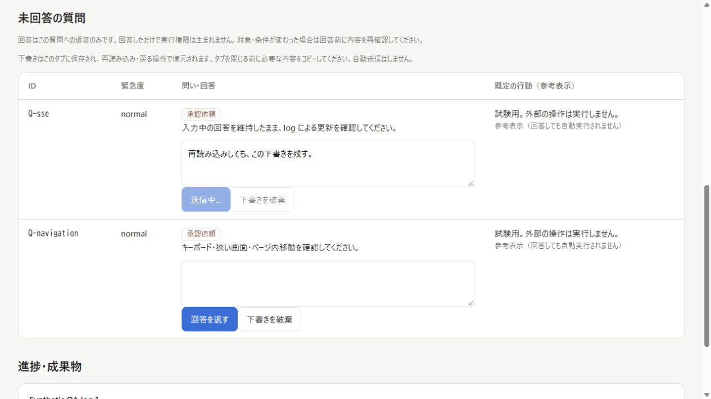

# Project dashboard: answer recovery verification

Checked: 2026-10-08, Windows, Node 24.13.0, Codex in-app Chromium.
Before source: 37d0b24ccdd78e42487ed9d4d20869383e6ab0da.
Fixed source: 2de41e66a446f5a9e5604c550df6ba28e1b1ed55.
The browser checks ran the working tree containing that product code, against the real Project server with synthetic data and the loopback fault proxy. No real project, Harness, DSHagentloop, or Tailscale service was used.

## Observed behavior

| Operation | Before | Fixed result |
| --- | --- | --- |
| Type Japanese answer, reload same tab | Empty textarea (reproduced again on baseline snapshot) | Exact text and newline restored; no automatic POST |
| Navigate to about:blank, then Back | Draft loss in the earlier #52 browser record | Exact text restored; no automatic POST |
| Hold Q-double POST, double-click, trigger log/SSE | Earlier #52 record: two POSTs, one saved answer | Button remains disabled and textarea read-only; one POST, one saved answer |
| Q-before: drop before backend, reconnect | Earlier UI lacked outcome reconciliation | Text retained and sending locked while offline; fresh state permits explicit retry; two attempts total, one forwarded, one saved answer |
| Q-after: commit, discard response, reconnect | Earlier UI treated response loss as a generic send error | Locked until state obtained, then answered; one POST, one saved answer, no retry; leading spaces and trailing newline preserved |
| 390 px viewport, draft, reload, explicit discard, reload | Draft persistence was absent | Draft restored, discard remains cleared; existing horizontally scrolling table retained |
| Q-sse: submit, hold, log/SSE, release (GIF) | — | Remains locked across update; one POST, one saved answer |

The final fixture snapshot records 5 transport attempts, 4 forwarded POSTs and 4 saved answers. Q-before accounts for the one discarded attempt. Q-navigation was only edited/discarded and has zero POSTs. These counts describe this synthetic run, not a guarantee of exactly-once HTTP transport.

## Automated verification

- Before product change: existing 18 tests passed; the first 10 new UI regressions failed on the original implementation.
- After change: `npm test --prefix dashboard` — 40/40 passed (18 existing + 22 UI regression tests).
- Tests execute the actual app.mjs with a small DOM boundary. This is unit coverage, separate from the browser evidence above.
- Additional cases cover project/question identity separation, changed questions/other answers retained for copying, old state responses, a GET started before send failure, storage denial/quota/malformed JSON, BFCache pageshow, selection preservation, explicit discard, and whitespace validation/preservation.
- `cargo fmt --check`, debug and release `cargo clippy --all-targets -- -D warnings`, and `cargo test --release --locked` passed; 65 Rust tests.
- Unix CLI regression: earlier isolated WSL 42/42 result reused after verifying Rust sources/tests and related scripts are unchanged; not rerun in this fix.
- `git diff --check` passed. Changed-file `secscan.py`: 6 files, zero findings.
- Independent change review found three issues (whitespace confirmation, blank-input feedback, retained-copy selection); all fixed and rechecked. Fresh-context requirements review found no unmet requirement.
- Fixture servers exited 0, temporary browser tabs closed, viewport reset.

## Screenshots

The screenshots are actual captures converted to PNG, with no replacement text or mock UI. The before image is a baseline fixture and the after image is the fixed fixture after other synthetic answers; counter differences are fixture progress.

## Limits

Same tab, same origin (scheme/host/port), same project/question only. Storage refusal falls back to memory and warns; it cannot preserve drafts across reload. No complete offline page snapshot, cross-device synchronization, or long-term draft history was added. This does not complete all of #71.
Real phone/IME input, Node 22/Linux dashboard CI, WSL/Tailscale browser routes and the upstream DSH Harness UI are not verified here. The 390 px test is a viewport test, not a real phone test.
The original #52 report remains a historical pre-fix report with its recorded failures; it has not been relabeled as passing.
