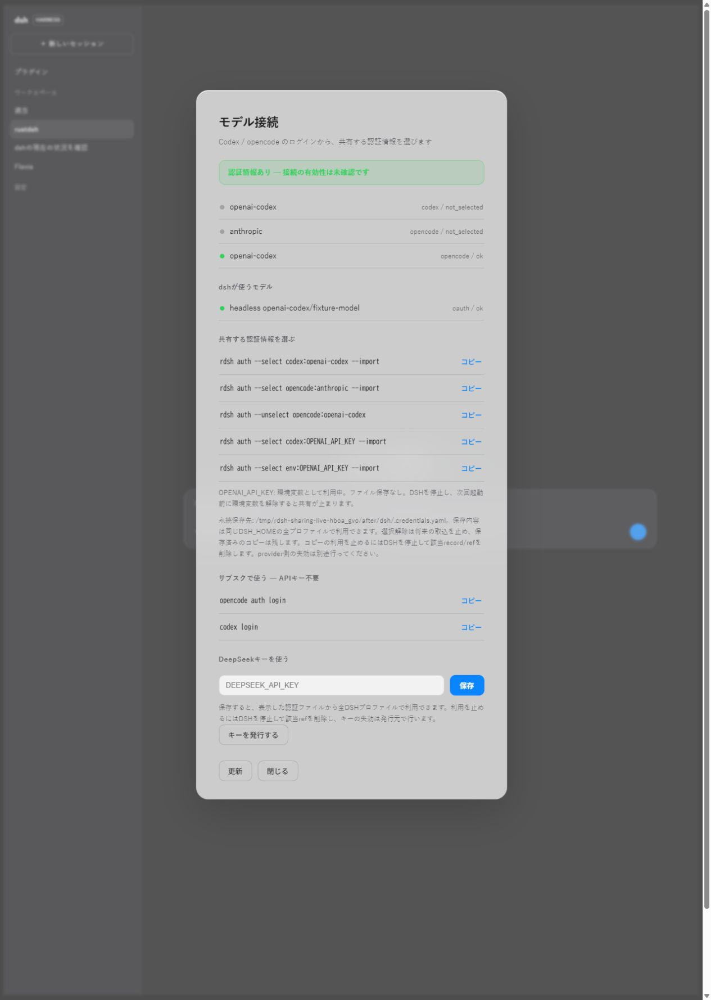
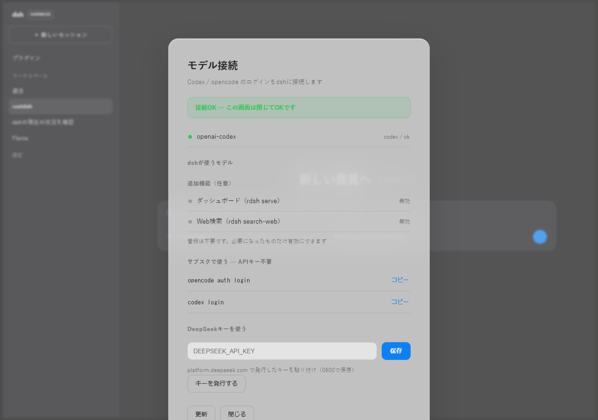
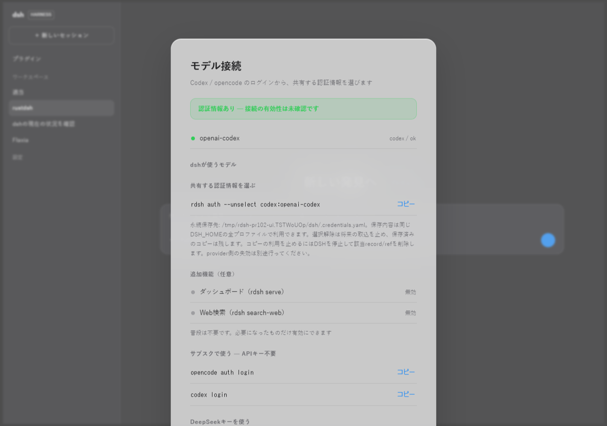
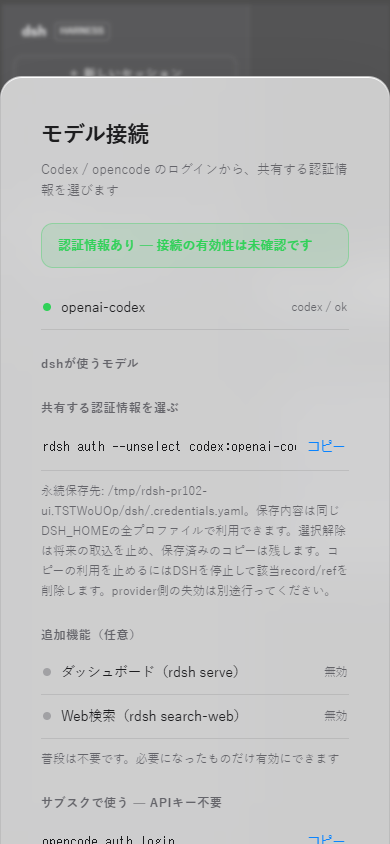

# Credential sharing example

These captures use actual release builds of rdsh setup --web, before the change
(main 9f2b940) and after it, with identical isolated Codex/OpenCode fixtures.
All keys and OAuth grants are test-only; no real provider request was made.
The screenshots show the real Rust HTTP server and browser UI.

## Before

auth --import copies both providers and Codex's separate API-key ref:

```text
import llm-pi-ai/anthropic from opencode
import llm-pi-ai/openai-codex from opencode
import ref OPENAI_API_KEY from codex
```


## After

auth --import without a selection exits 1 and writes no credentials:

```text
[rdsh] error: no credential sharing selected; preview rdsh auth, then use --select SOURCE:CREDENTIAL --import
```

Choosing only opencode:openai-codex with --select and --import copies one grant.
The other provider, Codex's OAuth and its separate API-key ref are not copied.
The supplied environment key remains a nonpersistent reference.

```text
import llm-pi-ai/openai-codex from opencode
```



The machine-readable [CLI result](auth-sharing-cli.json) was captured from both
builds using the same fixture input. Screen state distinguishes credential
presence from successful authentication and explains persistent scope and
separate unselect, saved-copy removal and provider revocation.

## Main integration re-review, 2026-10-08

The current main (`f2a7dc6b2850a6f0c0e1ea1b53494b12cd2e1221`) was merged into
this PR at `b57e5a5137c75a1247ad982eb8bb90d38e980b4e`. The resolution preserves
the credential-sharing inventory and its consent guidance alongside main's
optional Extras controls. Both English and Japanese guidance are retained.

An isolated Linux release build passed formatting, release Clippy on all targets,
81 Rust tests (70 unit and 11 credential-sharing integration tests), 13 plugin
security tests, 8 dashboard tests, 44 CLI regression checks, 20 settings checks
and 21 context checks. Credential tests use recognizable synthetic secrets and
assert that unselected sources are never copied and diagnostics do not disclose
credential values. Existing user stores and real provider authentication were
not used.

Installed Chrome and Playwright exercised the real Rust HTTP server through a
test-only Windows-to-WSL loopback bridge. The same synthetic fixture was used
before and after integration, in Japanese and English at 1280×900 and 390×844.
Both panels rendered without JavaScript page errors or horizontal page overflow.
Enabling serve was independently read back from rdsh.json, retained across reload,
and left the selected credential-sharing policy unchanged. This verifies the
settings flow; it does not establish model authentication or real-phone access.

The [machine-readable re-review result](auth-sharing-rereview.json) records the
exact source commits and all four before/after locale flows.







## Guarded-main and one-time import compatibility

Integrated main `98abc67d7e5c5d3f2a5321d9a56adb6a83ff93e2` at
`9f7f17b900c0049b267fa6bdd5428802970f101d`. This preserves main's restricted
tool runtime, atomic credential writes and recovery validation alongside
the persistent sharing policy. Removed main's host-specific tracked
`dashboard/node_modules` symlink; dashboard dependencies use the lockfile.

`auth --import --source codex --provider openai-codex` and `--ref` import only
the explicitly selected credentials for that invocation. They never widen or
save the persistent sharing policy. Integration checks cover provider filtering,
key-only filtering, preservation of existing consent, dry-run, invalid sources
and rejection of mixing one-time filters with persistent selection changes.

An isolated release build of this exact source passed 105 Rust tests (78 unit,
13 credential-sharing, 11 native E2E, 3 settings), 7 benchmark-example tests,
31 Node security tests, 182 dashboard tests (zero skips), 55 CLI checks,
20 settings checks, 21 context checks and 6 Python release-artifact tests.
Formatting and release Clippy on all targets passed with warnings denied.
The enforcement tests reject unsupported agent runtimes before copying any
credential; trusted `--version` metadata delegation still obeys saved consent.
Only synthetic credentials and dummy executables were used.

The sharing and Extras UI is unchanged from the EN/JA desktop/mobile captures
above. These are source-matched browser evidence from the earlier commit;
the latest CLI and security verification is the separate run described here.
Real model authentication and paid APIs remain untested.

## Integration after the native inspection merge

Merged main `b7120ff2f9d8acbb25664e4efc675c73ca7548c5` at source
`921ba9105b0223556c6a3b1811e0c0dd6ecbca4a`. The setup conflict retains
credential sharing and revocation guidance together with main's `noopener`
external-link protection. Native inspection limits, compressed-entry precision,
and the DNS-independent loopback regression fixture remain intact.

The isolated release validation passed 120 Rust tests, 7 example tests,
36 Node security tests, 182 dashboard tests, 55 CLI checks, 20 settings checks,
21 context checks and 6 release-artifact tests, with fmt and release Clippy
warnings denied. These counts belong to the exact source above.

An actual Rust setup server with synthetic credentials passed the English and
Japanese Chrome flows at 1280/390px. Sharing consent and Extras survived save,
independent file reads and reload without page errors or horizontal overflow.
The actual external-link button opened a controlled browser fixture with
`window.opener === null`; the browser intercepted that URL locally, without a
request to the real provider. The hint still explains shared credentials.

The [current browser record](auth-sharing-main186-browser.json) and actual
[Japanese desktop](auth-sharing-main186-ja-JP-desktop.png),
[Japanese mobile](auth-sharing-main186-ja-JP-mobile.png),
[English desktop](auth-sharing-main186-en-US-desktop.png), and
[English mobile](auth-sharing-main186-en-US-mobile.png) captures supplement
the unchanged UI-flow GIF above. No real credentials, models or paid APIs were used.
