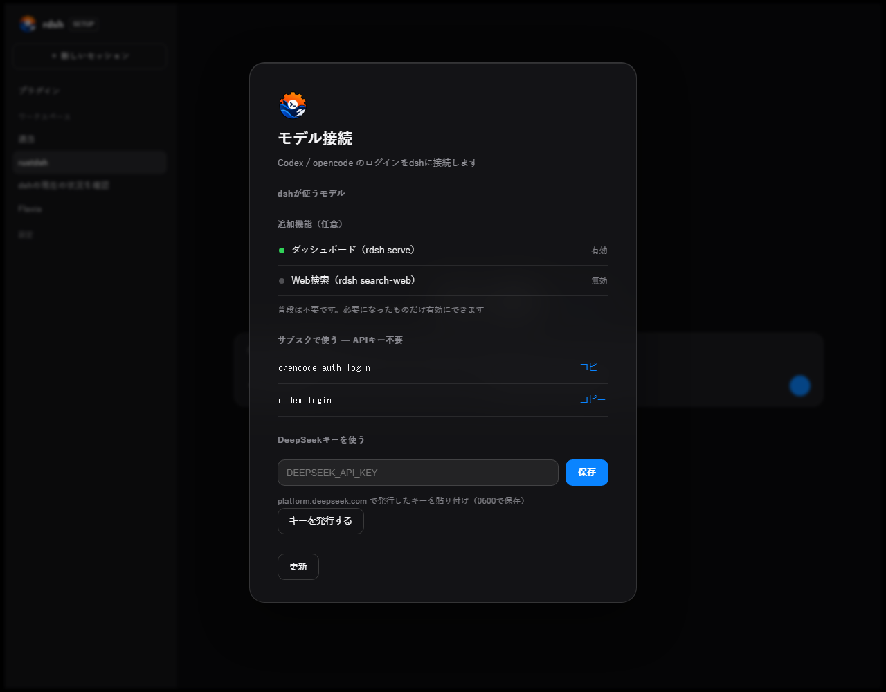
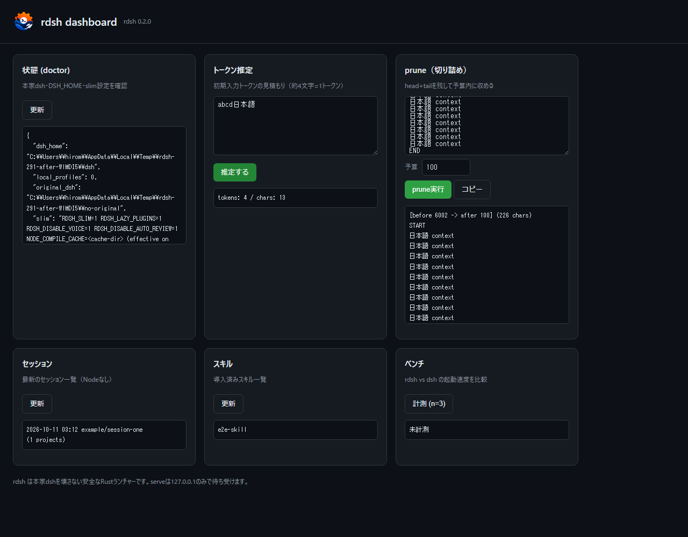

# Native HTTP Origin checks (#291)

2026-10-11. Before: `4f63db1c815cf9f969558f4ba0e3f20f2f7c943f`.
After: this PR. Real executables and isolated temporary HOME/DSH_HOME;
no real credentials, provider calls, Tailscale, or user configuration.

## Scope and compatibility

`rdsh setup --web` and `rdsh serve` share `local_http::Request::trusted`.
The original DSH owns conversations, profiles and model execution; its runtime,
the settings plugin, and the optional Node dashboard's authentication are unchanged.

Issue #291's triage notes require a compatibility decision for Origin-less native
clients. POST requests with any `Sec-Fetch-Site`, `Sec-Fetch-Dest`, or
`Sec-Fetch-User` header now require the existing matching loopback Origin.
Presence is checked even for empty/unrecognized values. Present Origin is still
validated on every method. GET navigation without Origin remains supported.
The parser currently accepts only GET and POST.

`Sec-Fetch-Mode` alone is intentionally insufficient: Node fetch supplies it on
ordinary authenticated requests without Origin. Native clients can also forge or
omit metadata, and older clients/proxies may not preserve it. These headers are
therefore an additional browser check, not proof of client identity or an
authentication replacement. Host validation and the per-launch token remain
mandatory. This does not claim an existing CSRF authentication bypass.

Reference: [Fetch Metadata request headers](https://www.w3.org/TR/fetch-metadata/).

## Observed HTTP difference

Identical raw HTTP requests were sent to the old and new binaries.
See [before](before.txt), [after](after.txt), and [output diff](http.diff).

| Request | Before | After |
| --- | --- | --- |
| Setup save, token + browser metadata, no Origin | 200, settings changed | 403, settings unchanged |
| Setup stop, token + browser metadata, no Origin | 200 | 403, server remains available (integration test) |
| Serve tokens, token + browser metadata, no Origin | 200 | 403 |
| Matching loopback Origin + token | 200 | 200 |
| Native client / Node-style Mode only + token | 200 | 200 |
| Foreign Origin / missing token | 403 / 401 | 403 / 401 |
| GET navigation without Origin | 200 | 200 |

The new unit and executable integration tests failed against the old code before
the fix. Regression coverage includes both servers, persistence/stop side effects,
individual metadata headers, mixed-case HTTP names, empty/unknown values, invalid
Host/Origin, both allowed loopback origins, and token enforcement.

## Verification

| Command / environment | Result |
| --- | --- |
| Windows baseline: `cargo test --release local_http::tests`; `cargo test --release --test native_e2e http` | 1 + 3 passed |
| Linux baseline: same targeted commands; `sh tests/regress.sh` | 1 + 3 + 55 passed |
| `cargo fmt --check` | passed |
| Linux: `cargo clippy --all-targets -- -D warnings`; release equivalent | both passed, zero warnings |
| `cargo test --release` | Windows 92; Linux 110 passed |
| Linux: `cargo test --release --example benchmark_extended`; `--example benchmark_models` | 2 + 5 passed |
| Linux: `node --test tests/model_benchmark/fence.test.mjs` | 2 passed |
| Linux: `sh tests/regress.sh` | 55 passed using original DSH 0.2.0-rc.2; `doctor` passed |
| `RDSH_E2E_BIN=<binary> npm test --prefix tests/e2e` | old/new: 3 browser flows + 13 update-banner flows passed |
| Real Chromium native UI; real Node fetch | old/new passed; Node v24.13.0 without explicit Origin/Fetch Metadata returned 200 and 4 tokens |
| Independent code and requirements reviews | no findings |

Windows: Rust 1.93, Node 24.13.0, Chromium headless shell. WSL/Linux: Rust 1.99,
Node 22.23.3. Windows reports the pre-existing unused import in `src/search.rs`;
it is present before and after. Zero-warning Clippy verification above is Linux.
macOS and physical mobile devices were not tested for this backend-only change.

The initial browser suite reported an SSE reset after deliberately stopping the
server with its final page still open. The runner now closes that page first,
as it already does for other pages. Both binaries then passed the unchanged
error assertions. No console-error filtering was added.

Local lightweight security scan flagged the existing `spawn(command, args)`
test helper in `tests/e2e/browser.mjs`. That helper takes fixed test entry points,
uses no shell, and is unchanged; this patch changes only page/child teardown order.
The finding was reviewed and not changed. No other scan findings.

## Actual UI captures

No HTML/CSS or navigation behavior changed. These captures demonstrate that the
normal authenticated setup and status workflows still work under the new check.
Chromium's actual POST headers were inspected with CDP: matching Origin,
`Sec-Fetch-Site: same-origin`, `Sec-Fetch-Dest: empty`, `Sec-Fetch-Mode: cors`.
The missing-Origin negative case above is a wire-level test, not a claim that
Chromium naturally omitted its Origin.

| Existing operation | Before | After |
| --- | --- | --- |
| Setup: enabling `rdsh serve` persists after reload |  |  |
| Serve: token estimate and prune results |  |  |

[Before flow](flow-before.gif) / [After flow](flow-after.gif): each GIF sequences
seven actual screenshots (8.44 seconds): setup off → on → reload → serve open →
token estimate → prune → reload. They are screenshot sequences, not continuous
screen recordings. Differences in temporary paths and timestamps are test fixtures.
