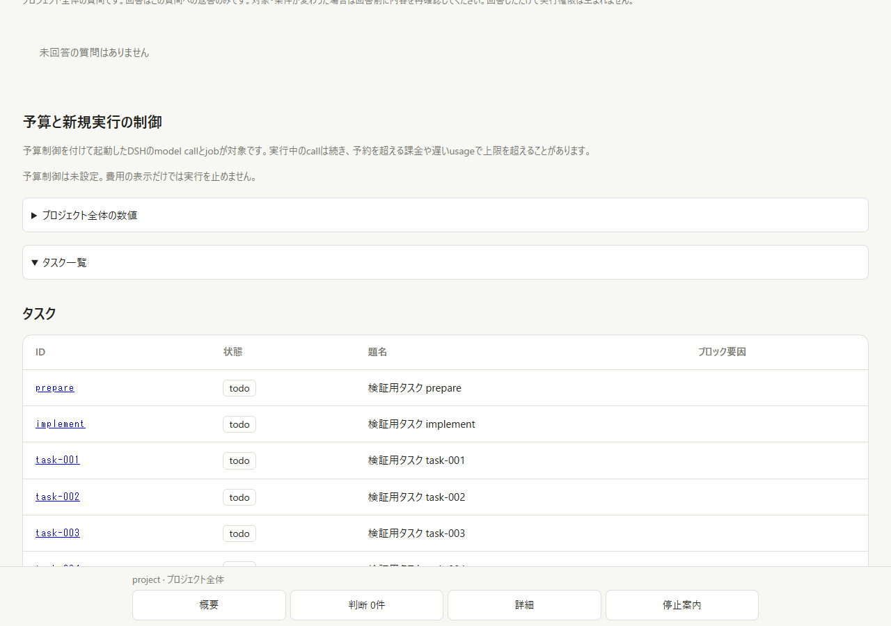
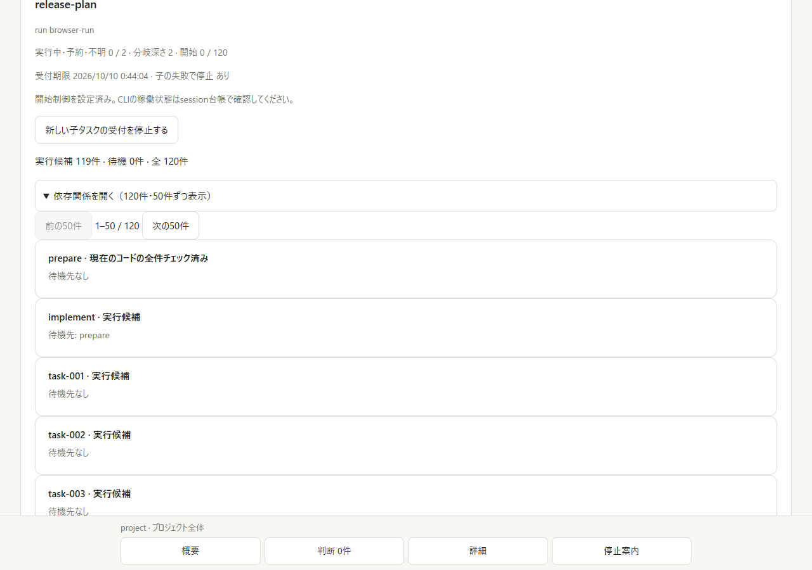
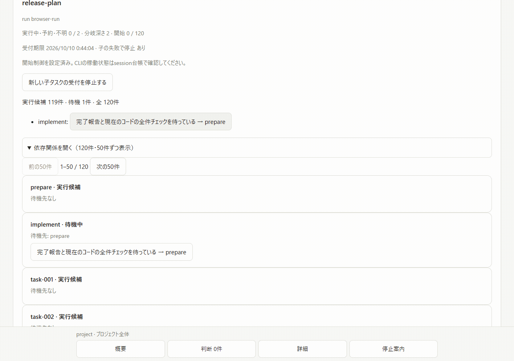

# Bounded execution plan evidence

Issue [#15](https://github.com/jimoto-no-llm/rustdsh/issues/15).
Runtime source: `b9059072dc8117c940e333917397e2c17c7e6bbb`.
Main baseline: `7a7435b292497bd9992e63bf900bd20ffa97f999`.
The subsequent commit adds evidence and isolated reproduction scripts only.

## Actual before/after outputs

[Native outputs](native-before-after.json) were captured by
[before-after.mjs](before-after.mjs) using the same published Workflow,
SubagentRuntime and spawn registration with a synthetic provider and PTC transport.
The baseline guest uses its original supported options; the bound guest includes
the explicit `rdshTaskId` opt-in extension. Neither invokes a real model.

| Scenario | Original unbound run | Explicitly bound run |
| --- | --- | --- |
| Two simultaneous requests for one task | Two provider starts | One provider start; second request refuses `task_already_claimed` |
| Dependent task without current full QA | One provider start | Zero provider starts; `prerequisite_unverified`, even after native parent completion, disposal and reported task `done` |

The engine's `agentsStarted` counts guest requests; the recorded provider
`dispatches` and durable claims establish which child factories actually ran.
The [nested branch capture](native-branch-portable.json) confirms native depths
1 and 2, child/parent correlation and confirmed disposal for both children.
[Its driver](native-branch-driver.mjs) and [runner](native-branch-runner.mjs)
use repository-relative imports. [The original capture](native-branch.json)
records the same frozen runtime source before packaging.

## Real browser captures

These are actual isolated project HTTP/browser screenshots, not mockups.
The before image uses the main HTML/app bytes over the same current isolated
backend: this is a frontend comparison, not an old-backend execution claim.
The [flow GIF](flow.gif) assembles four captured step images at 1.5-second intervals.
It is a sequence of observed states, not a recording of interaction latency.

| Before | After: current prerequisite verified |
| --- | --- |
|  |  |



- [Collapsed graph](after-collapsed.png): no task graph rows until expanded.
- [Waiting prerequisite](after-dependency-wait.png): exact blocker navigation.
- [Last page](after-last-page.png): 120 nodes, maximum 50 rendered rows per page.
- [Operator stop](after-stop.png): persisted refusal of new child starts.
- [390px mobile](after-mobile.png): no horizontal overflow.

[Windows browser observations](browser-windows.json) record a 29.90 ms blocker
navigation and a 4595.34 ms observed independent refresh; the configured poll
interval is five seconds. Page and expansion survive the refresh after an actual
local acceptance command. [Linux observations](browser-linux.json) passed the
same five flows. These measurements are from one local fixture, not a latency
guarantee or human usability approval.

## Final frozen-source QA

The [verification report](verification.json) includes source identities and
SHA256 hashes for the [Windows output](qa-windows.txt) and
[Linux output](qa-linux.txt). Every mandatory command completed before PR creation.

| Check | Windows | Linux |
| --- | --- | --- |
| Full dashboard suite | 206/206 pass, zero skips | 201/206 pass, five Windows-only skips |
| Published native Workflow admission | 12/12 pass, zero skips | 12/12 pass, zero skips |
| fmt / release Clippy | No Rust source changed | Both pass; zero warnings |
| Rust release / example / fence tests | No Rust source changed | 103 / 7 / 2 pass |
| CLI regression / plugin, security and updater | No Rust source changed | 55 / 49 pass |
| Existing browser / update banner / plan browser | Plan browser pass | All three suites pass |
| Nested native branch / before-after output | Pass | Native suite covers the admission cases |

An earlier Windows harness invocation ran from repository root, causing the
stdio fixture's relative `cli.mjs` entry point to fail. The final complete suite
ran from `dashboard` and passed 206/206. No stdio production code was changed.

## Local admission cost

[Windows measurements](benchmark-windows.json) and
[Linux measurements](benchmark-linux.json) each cover 20 original Workflow
start/result/disposal operations, using a synthetic provider with a 5 ms delay.
The [benchmark](../plan-admission-benchmark.mjs) excludes Node boot and includes
guest parsing and durable local audit; it declares no dependencies or acceptance
criteria. It does not measure network, inference, or production filesystem costs.

| Platform | Unbound median / p95 | Bound median / p95 | Added median |
| --- | --- | --- | --- |
| Windows, Node 24.18.0 | 6.48 / 8.76 ms | 34.70 / 37.45 ms | 28.22 ms |
| Linux, Node 24.21.0 | 6.10 / 6.89 ms | 43.99 / 47.46 ms | 37.89 ms |

## Reproduce and scope

Install the isolated public dependencies and run the full checks described in
[BOUNDED-EXECUTION-PLANS.md](../../BOUNDED-EXECUTION-PLANS.md). Then:

```sh
RDSH_TEST_PLAN_PACKAGE=/isolated/native-plan/package.json \
  node docs/evidence/execution-plan/before-after.mjs
RDSH_TEST_PLAN_PACKAGE=/isolated/native-plan/package.json \
  node docs/evidence/execution-plan/native-branch-driver.mjs
```

Optional `RDSH_QA_SOURCE_HEAD` records the caller's verified source identity.
The scripts use temporary projects and fake HOME/DSH_HOME, clean only their own
fixtures, and do not read real credentials or boot a user profile.

The explicit attachment supports Node 22.15+/24 and the SHA-audited DSH
0.2.0-rc.2 in-process spawn seam. Independent external ACP/SDK descendants are
refused before their factory. Unknown startup/outcome/disposal retains capacity
and is not replayed automatically. Actual provider calls, production PTC
confinement, paid-model execution, human UX approval and main merge are not
claimed. Original unwrapped delegation stays unchanged.
