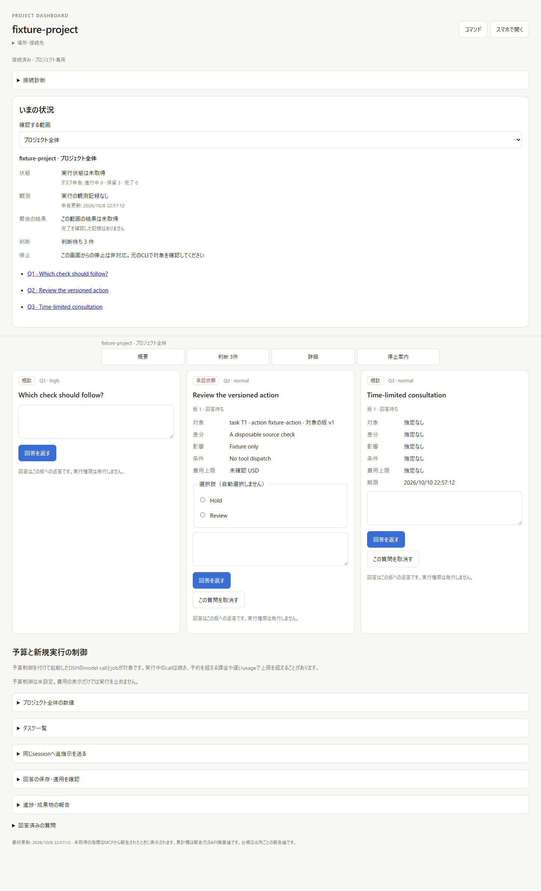
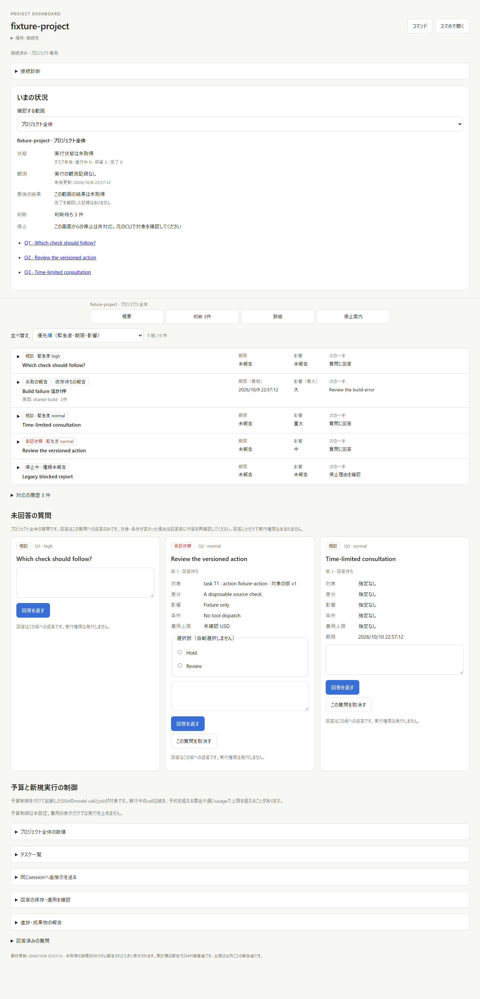

# Attention inbox: current main integration

PR #196 resubmits the product code and history from closed PR #180. This check
merges main `96dbcbbd6e1295b2e92ba31e9cf9037770107b24` and checks source
`e95ab19942df05ad8c25af3960ccafff6ba1560c`. The only additional changes are
documentation link remapping and the blocking BSD HTTP test socket.

On 2026-10-08, an isolated WSL2 source archive passed fmt, release Clippy with
zero warnings, Rust release 103 tests, both example suites (7 tests), 49 Node
security/settings/banner tests, CLI regression 53 checks, settings 20 checks,
context 21 checks and Python asset validation 6 tests. Dashboard 205 tests
passed with no skipped tests using Node v24.21.0.

The exact-source GitHub CI passed Linux, macOS, Windows, browser E2E, security,
CodeQL and documentation checks, including Windows/Linux dashboard testing.
A local Windows run from the repository root passed 204/205: the stdio MCP
fixture could not find `cli.mjs`, which is relative to the dashboard working
directory. Rerunning that suite from `dashboard/`, as CI does, passed all 5
tests with Node v22.23.3. This was a test invocation error.

Windows Chrome with a real disposable Project HTTP server checked the four
sort choices, shared causes, ordinary log updates, navigation to folded tasks,
draft and focus preservation, cancellation, expiry, answered items and the
original history. Both 1440px and 390px views had no horizontal overflow,
executed injected markup or page errors. These fixtures dispatch no models,
paid APIs or real tools, and do not prove physical phone or Tailscale behavior.

| Before | Current main integration |
| --- | --- |
|  |  |

[History](attention-inbox-history.png), [390px view](attention-inbox-mobile.png)
and [browser observations](browser-results.json) are from this run. The
[previous review](../issue-13-rereview.md) retains the earlier source's PNG/GIF
and acceptance details; its counts are not substituted for this run.

## Setup completion response correction

On 2026-10-09, head `1d37a5963dd8568cd4fcf560bd5464665178472a`
failed the hosted Ubuntu native test because an HTTP response was empty.
The authorized `/api/done` handler set the completion flag before writing
its acknowledgement, allowing the main thread to exit first. Source
`dc60b12e9c67a34fb139bd048af6b26a7ac9b180` sets the flag only after the
complete response has been written successfully.

That immutable source passed Linux debug and release Rust suites (103 tests
each), release Clippy with zero warnings, examples 7, model fence 2, CLI
regression 53, security boundaries 11 and the 8 existing browser flows.
The authenticated completion/restart flow passed 15 additional runs in
each build mode. It also verifies that an unauthenticated completion request
returns 401 and leaves setup available, and that successful completion
returns the full `{"ok":true}` body before the owned process exits.

The [before/after output](setup-completion-before-after.txt) retains the
failed Actions job URL. [Source and validation data](setup-completion-validation.json)
separate this local Linux result from later Windows/macOS and head CI.
Dashboard files, the inbox UI and its original screenshots are unchanged.
