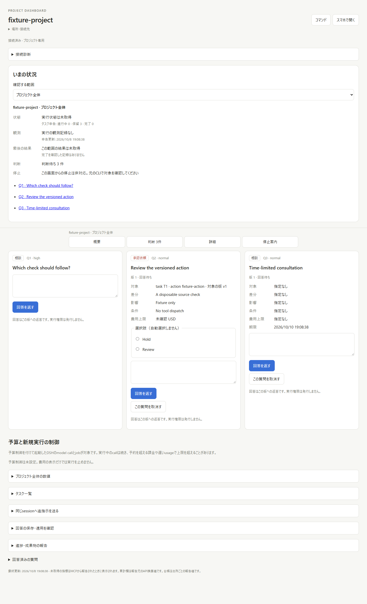
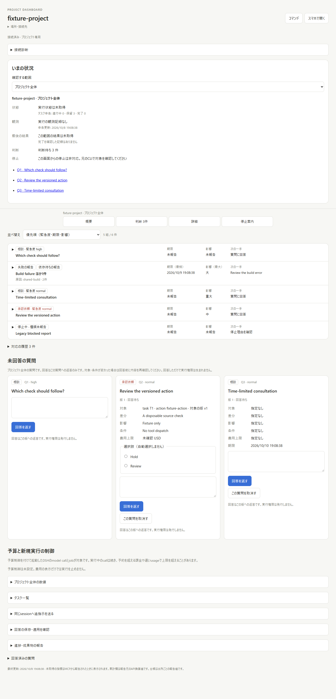
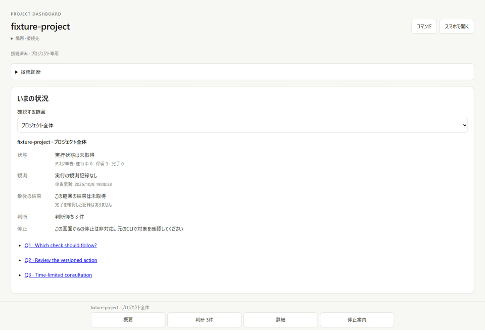
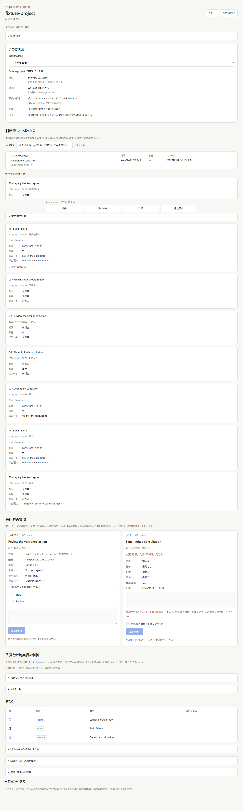
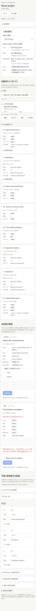

# Decision inbox: current-main integration

The integration merges main `1fdec5fc2bb77f76901726fe616396b5371016f0` into
`ebfc0599cf07800c26964bcbf81c11b0253103b0`. The original inbox is retained beside
the current project overview, typed questions, reply applications, and cost/budget
panels. `2c228c643a98b48187306016fb1232b625e01cf6` uses the current typed decision
kind for approval/consultation labels rather than inferring it from default_action.

## Review fixes

- Cancelled and expired typed questions leave the actionable inbox. Legacy
  questions remain compatible; reported attention deadlines do not expire them.
- Optional attention works with strict typed-question inputs and survives an
  omitted field during revision. Invalid reports are rejected before creation.
- Saved answers retain their original attention snapshot in feedback, so revising
  a question cannot replace the answered report's cause or next action in history.
- Navigation opens the current folded task section before focusing its row.
- Question labels follow the current contract kind. None of these display fields
  grants permission or dispatches an operation.

## Verification

- Windows Node 22: the integrated dashboard suite passed 205 tests, no skips.
  The final view-only label fix was then checked in the real browser.
- Linux Node 24: all 205 dashboard tests passed at `2c228c6`, no skips.
- The focused report/lifecycle/API suite passed 23 tests, including HTTP, legacy
  MCP, stdio, and MCP 2 transport equivalence and human-answer authority checks.
- Rust, Cargo configuration, plugin security checks, and CLI regression files are
  byte-identical to main `1fdec5f`. That same source passed Rust 68, plugin 13,
  CLI 53, settings 20, context 21, fmt, and release Clippy during the independent
  task-contract integration review. No separate Rust run is claimed for this PR.
- Real Windows Chrome used the production UI, actual Project HTTP server, and
  durable state in a disposable fixture at 1440 px and 390 px. All four sorts,
  shared-cause grouping, ordinary-log exclusion, folded task navigation, answer
  draft/focus retention, human cancellation, typed expiry, answering, and partial
  resolution passed. History kept cancelled/expired/answered questions and the
  original classified/unclassified stop reasons. No markup executed, no page
  errors occurred, and neither viewport had horizontal page overflow.

The [sanitized browser result](issue-13/rereview-browser.json) pins the runtime
source. The before image serves main's UI against the same disposable fixture
and backend data. No real model, provider, tool, or external project was used.

## Actual captures

The implementation is ready for review as an explicit-report inbox. Automatic
Harness monitoring, external notification delivery, and physical phone/Tailscale
testing are outside this evidence. The sorting proposal remains stated in the
README for the maintainer's review.

## Guarded-main integration

Integrated main `57777a61f7b3043b890f52cd5fd400ed761290b1` at
`5017a84a5bfbaf9e67487ec9d7a72ae4fa00feeb`. Dashboard sources are byte-for-byte
unchanged from the 205-test Windows/Linux runs and browser capture source above.
The merge adds the main launcher's restricted tool runtime and release checks.
Its Rust, security implementation and CLI regression sources match the current
issue #75 integration that passed Rust 74, Node security 29, CLI 53 and Python 6
checks locally. The final head's own GitHub matrix is also required before
approval. No real model or tool execution was performed for the inbox feature.
