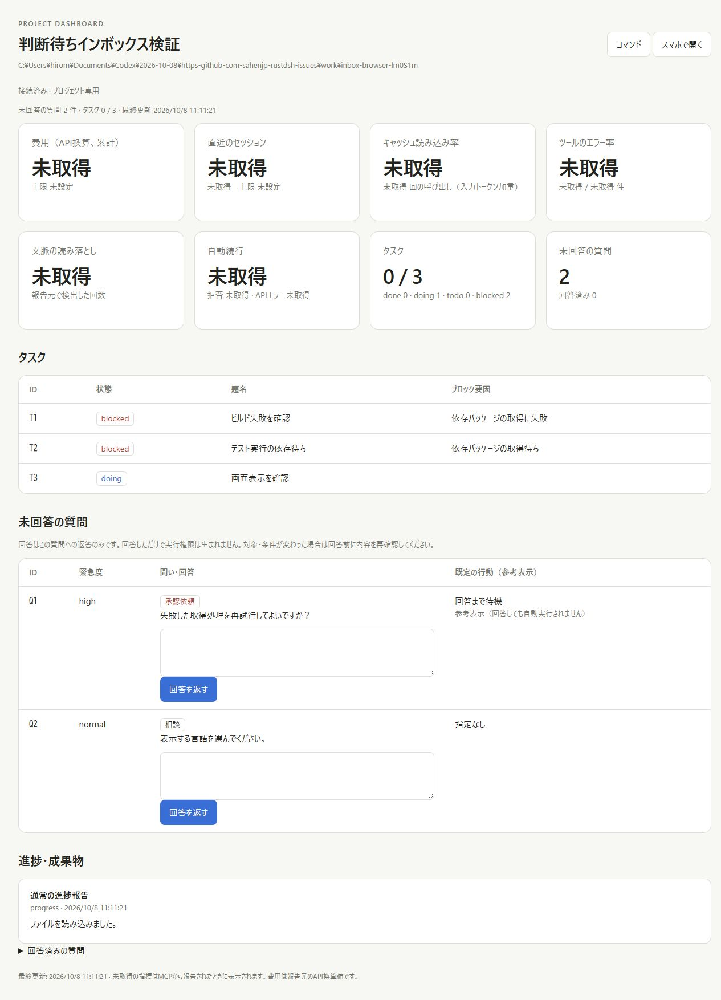
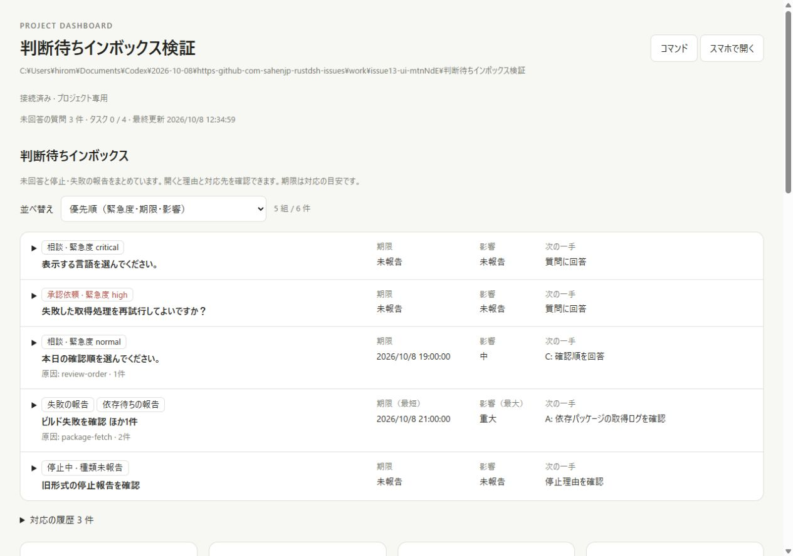
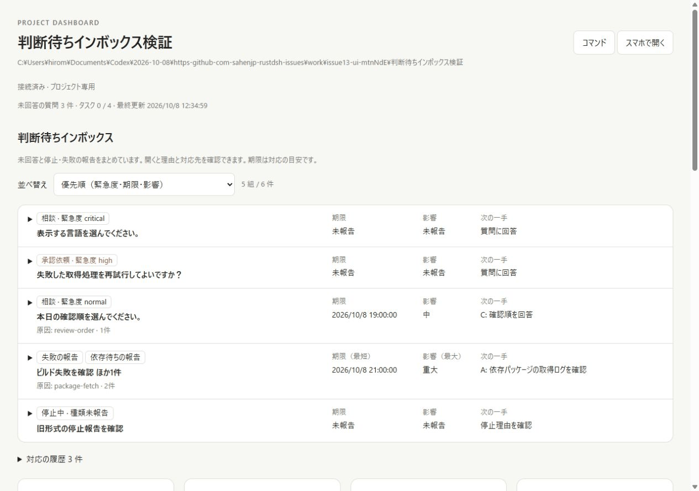
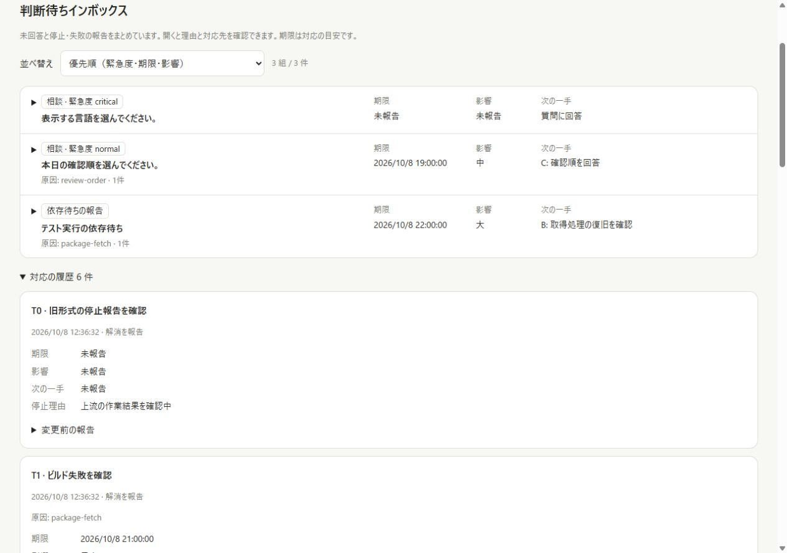
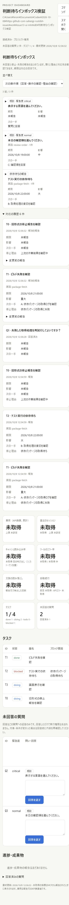

# Decision inbox: scope and browser evidence

The captures below describe the original `f2a7dc6` baseline. See the
[current-main re-review](issue-13-rereview.md) for the subsequent integration,
typed-question lifecycle fixes, and fresh tests/captures.

Issue: [#13](https://github.com/sahenjp/rustdsh/issues/13).
Baseline: `f2a7dc6b2850a6f0c0e1ea1b53494b12cd2e1221`.

## Scope and design choices for review

The Issue asks people to find decisions without reading every log. This extends
the existing Node project dashboard and its MCP/HTTP task/question reports.
It does not change the Rust launcher status page or the Harness agent runtime.

| Issue requirement | Implementation and evidence |
| --- | --- |
| Unanswered questions, failures and stopped dependencies | Existing questions and unclassified blocked tasks work unchanged; explicit reports identify failure/dependency without parsing logs or blocker prose. |
| Deadline, impact and next operation, with sorting | Reported fields remain visible. The selector offers each order plus a default priority; missing deadline/impact remains unreported. |
| Group the same cause without noisy log alerts | Explicit cause IDs group within a project; unknown causes remain separate. Logs and metrics never create inbox items. |
| Remove answered/resolved items and retain history | Human answers, completed tasks, stopped-task resumption and explicit resolution remove only affected members. Original reports, stop reasons and answers remain durable. |

Priority is a proposed rule, not a requirement already decided by the Issue:
question urgency, deadline, impact, operation type, age, then ID. Urgency stays
separate from impact. Next-operation order means answer a question, review a
reported operation, then inspect a stop/failure reason; free text is not sorted
alphabetically. Explicit failure/dependency reports persist until done or cleared;
legacy unclassified stops clear when their status leaves blocked. A new stopped
episode can reopen after completion or explicit resolution.

Maintainer review is requested on these priority/compatibility rules and the
reporting contract. [#74](https://github.com/sahenjp/rustdsh/issues/74) supplies
the broader single-user workflow. Dependency execution (#15), typed/revisioned
questions (#40), same-session answer application (#41), and notification delivery
(#56) remain separate work. This PR only navigates to the existing task/answer UI.

## Actual browser captures

Captured on 2026-10-08 using the Codex in-app browser, Node.js 24.13.0 on Windows.
The documented entry point was:
`node dashboard/cli.mjs project --project <fixture> --port <free-port> --no-tailscale`.
The project and RDSH_DASHBOARD_HOME were isolated synthetic fixtures. Reports
used the existing authenticated API. No real project, model call or external
service was used. JPEG browser captures were converted to PNG without pixel
editing; the GIF combines actual captures with white padding where needed.

Before (main): three tasks, two unanswered questions, and an ordinary event.
There is no combined inbox; questions and task stop reasons are separate.

After (1280 × 900): four tasks and three unanswered questions exercise old inputs
as well as explicit failure/dependency reports. Two reports share one cause:
five groups / six items. Critical Q2 precedes high Q1, both without new metadata.
The unclassified legacy task remains separate and exposes its original blocker.

[Full page with the legacy stop expanded](issue-13/after.png)

Q1's button opens the existing answer field. An ordinary SSE update preserves the
draft and focus without adding alerts. After the human answers Q1, the count
becomes four groups / five items. Completing T1 and resuming the legacy T0 then
leaves three groups / three items; T2's dependency remains. The API retains the
exact human answer, and history shows both original classified/unclassified stop
reasons after resolution.

At 390 × 844, document width was 390px and inbox width 360px: no horizontal
overflow. The mobile image shows remaining items and the accessible history.

## Verification and limits

- Dashboard tests: 29 passed. The six intent/lifecycle regressions were reproduced
  before their fixes. Tests cover old input, grouping, sorting, persistence,
  restart, invalid input, history, partial resolution and recurrence.
- HTTP, legacy MCP, stdio and MCP 2 accept the same report contract. Human answers
  are readable through dashboard_get_feedback on all three MCP transports with
  cursor behavior verified; reporting keys still cannot submit human answers.
- Real browser: priority/deadline/impact/operation sorts, old blocked detail,
  answer navigation, draft/focus over SSE, human answer, completion, history,
  desktop/mobile layout; no console warnings or errors in the final fixture.
- Required Rust checks had already passed on this unchanged Rust baseline:
  fmt, debug/release clippy, 65 release tests and 42 Unix CLI regressions.
- Independent code and requirements reviews completed; the stop-reason history
  omission found during review was fixed and rechecked.
- Live Harness/model workflows, same-session application, physical phones and
  external Dot/Tailscale connections were not tested. Local fixture results do
  not establish those integrations.
