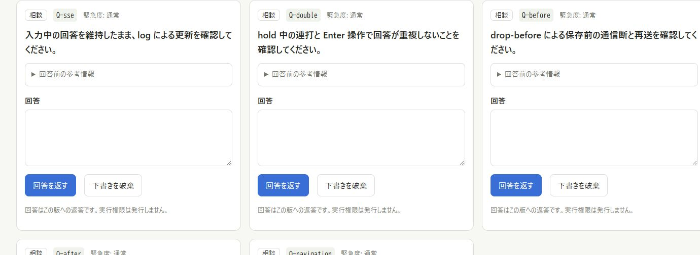
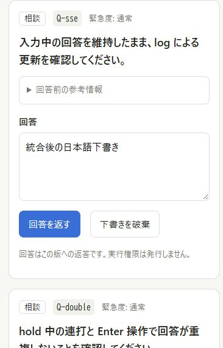
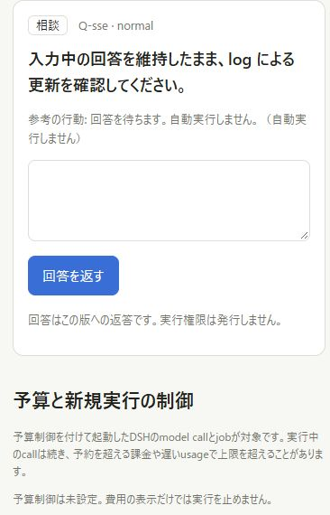
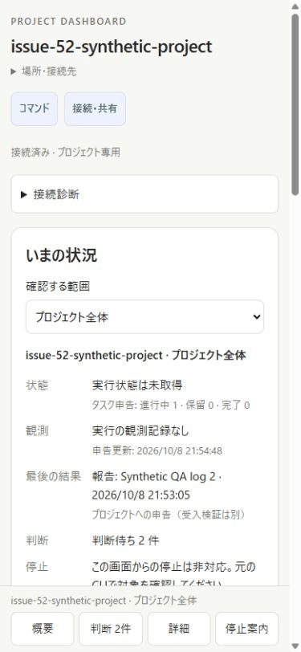
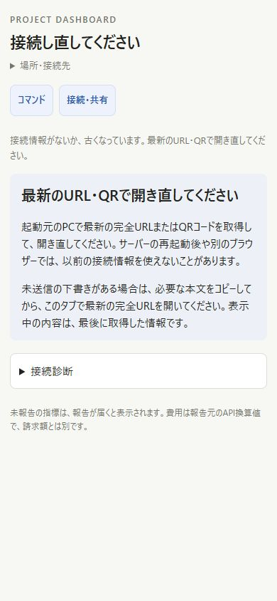
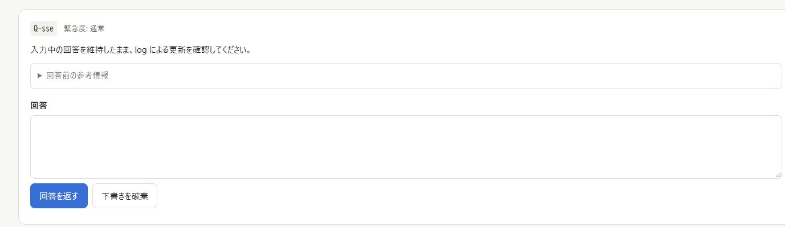
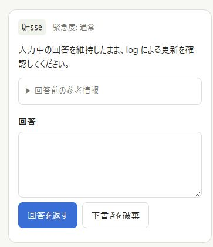
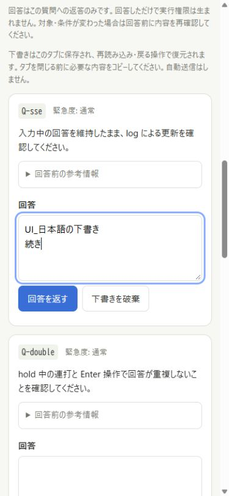

# 画面と操作の証拠

画像は既存の実ブラウザーによる撮影。モックや生成画像ではない。ソース版の違う画像を最新コードで再撮影したものとは扱わない。

## main統合後のPC・携帯幅表示

2026-10-08、main `96dbcbb`への統合後にPC実ブラウザーで撮影。[統合後のソース記録](current-source-manifest.json)と[検証条件](current-integration.md)を参照。両方で、**質問文 → 初期状態で折り畳んだ「回答前の参考情報」 → 回答欄**の順になっている。PCでは複数の質問カードを横に並べ、各カード内の参考情報の位置を携帯幅と揃えている。

PC・1440px幅：

携帯幅・390px：

携帯幅の画像はPCブラウザーの表示幅試験で、iPhone実機写真ではない。main統合後のiPhone・WSL/Tailscale実接続は再試験していない。

上のPNG2枚は実撮影した同名JPEGから、画像内容を変更せず再エンコードしたもの。元のJPEGも保持している。[画像ごとのSHA256と保存時刻](image-manifest.json)を記録した。保存時刻は撮影操作の厳密な時刻を示さない。

## mainからの携帯幅表示の比較

どちらもPC実ブラウザーの390px幅。左は変更前main `96dbcbb`、右は統合後。同じ合成質問の参考情報と回答欄の配置を比較する。右の下書きは操作試験で入力した本文であり、画像への後付けではない。

| 変更前main：参考情報を常時表示 | 統合後：参考情報を折り畳み、回答欄にラベル |
| --- | --- |
|  |  |

## 統合後のコマンド開閉と認証案内

390×844のPC実ブラウザーで「閉じた状態→開く→閉じる」を撮影した3画像から作成したGIF。補間した動きや生成フレームは含まない。開いたコマンド欄の幅は335pxで、390pxの表示領域内に収まることを確認した。

無効な接続情報による401の読み込み完了後に撮影した案内。続いて有効な完全URLで開き直し、案内が消え、Q-sseの未送信本文が残ることを確認した。

保存前後の切断と送信ロックは[操作結果](current-integration.md)・[最終件数](integrated-browser-counts.json)へ記載した。

## 統合前のPC・携帯表示

2026-10-08、[旧ソースsnapshot](source-manifest.json)を起動したPC実ブラウザーで撮影。main `96dbcbb`へ統合した後の表示ではない。1440px幅と390px幅の両方で、**質問文 → 折り畳んだ「回答前の参考情報」 → 回答欄**の順序を確認した。参考情報は初期状態で閉じ、クリックすると開閉できる。

携帯幅の画像はPCブラウザーの表示幅試験で、iPhone実機撮影ではない。統合後の確認は[別記録](current-integration.md)を参照。

PC・1440px幅：

携帯幅・390px：

## 下書き復元の前後

以下は**下書き復元を修正した時点の旧レイアウト**で、現在のPC表示ではない。2026-10-08、Windows、Node 24.13.0、PCのCodex内ブラウザー、合成Project。修正前は`37d0b24`、修正後は`2de41e6`。同じタブで本文を入力して再読み込みした結果を比較した。[当時の手順と集計](../answer-recovery/browser-checks.md)

| 修正前：本文が消える | 修正後：本文が残る |
| --- | --- |
|  |  |

## 送信保留中の更新から保存まで

同じ修正後試行の実撮影。SSE更新で送信ボタンが再び押せるようにならないこと、保留解除後に回答が保存されたことを確認した。iPhoneで行った再読み込みを挟む連打試験とは別のPC試行。

## 統合前のスマホ向け回答欄

2026-10-08のUI追試。PCブラウザーの390px幅で撮影した実画面であり、iPhone実機写真ではない。質問の下に回答欄を全幅で置き、参考情報を折り畳める。本文は合成試験用。

コマンドのiPhone表示、QR表示、認証案内と復旧は本人の操作・写真・接続ログで別途確認している。実機写真の端末ホスト名や認証URLは公開画像として転載していない。[追加確認](verification.md)
