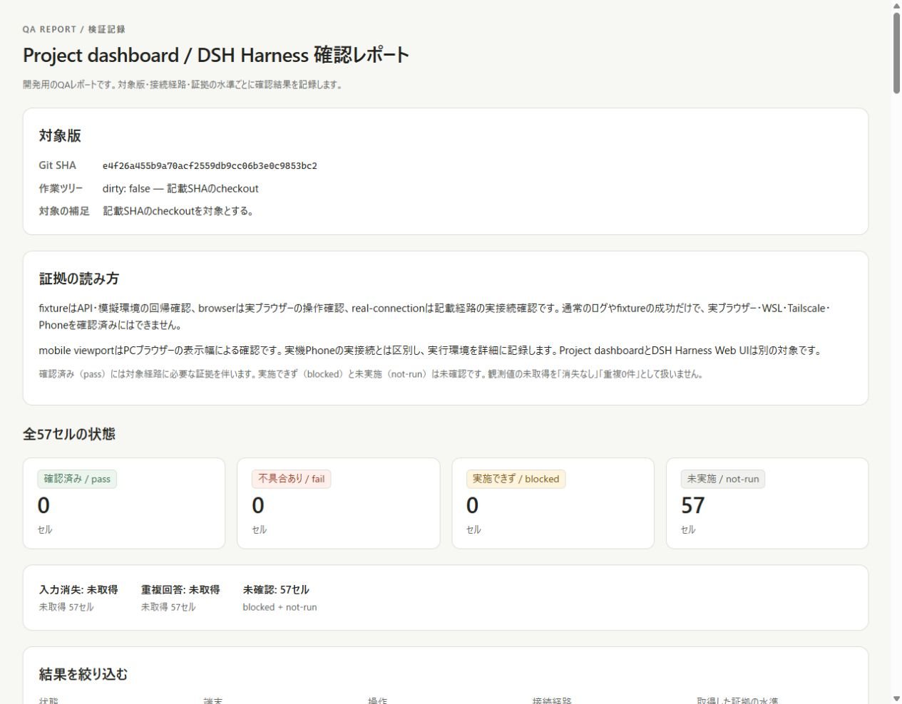
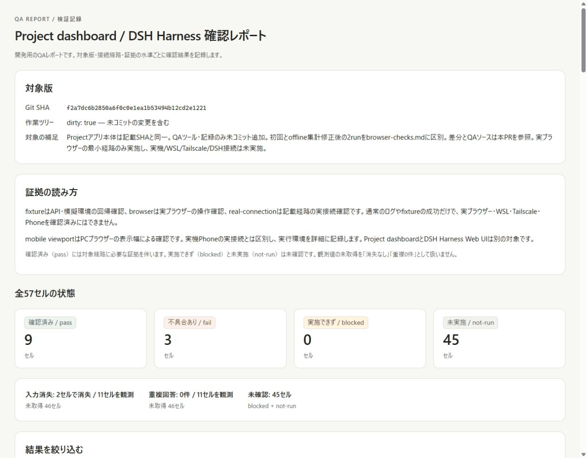

# Issue #52: 実ブラウザーの確認記録

対象アプリ: main `f2a7dc6b2850a6f0c0e1ea1b53494b12cd2e1221` の
Project dashboard（server.mjs / app.mjs / ui.html は変更なし）。
追加QAツールを含む未コミット作業ツリーで実施。
この記録と results.json は本PRのQAソースと一緒に保存する。

環境: Windows、Node 24.13.0、Codex in-app browser（Chromium系、版番号未取得）。
desktop viewport 1280×900、mobile viewport 390×844（DOM clientWidth 375）。
mobileはPC上の表示幅確認で、実機スマホ・タッチ・IME変換中の試験ではない。
実行時間: 2026-10-08 04:03–04:10 UTC。個々の時刻は対応するイベント時刻
または一連の操作の終了時刻を記載。

## 起動・証拠

```sh
npm ci --prefix dashboard
node dashboard/qa/fixture.mjs --directory <isolated-parent>
```

起動時の合成データ用URLを実ブラウザーで開き、画面操作はCUAの実入力・クリック・
キーボード・再読込・戻るで行った。DOMは観測だけに使用し、fetchやDOM書換えで
画面操作を代用していない。障害操作はfixtureのstdinから行った。
既存DSHの起動・agent loop・WSL・Tailscale・Dot接続はこの試験に含まれない。

- `run-1.json`: 最初の実ブラウザー一連操作終了時のfixture集計。
- `run-2.json`: offline POST集計修正後に受理前切断を再試験した結果。
- 画面キャプチャはローカル成果物に保存した。公開用の本記録は合成入力・
  DOM観測と上記の資格情報を含まない集計を残す。実行時URL・鍵・runtime.jsonは含めない。

初回fixtureにはofflineの自動再試行を質問別に帰属しない計測上の不足があった。
修正後の受理前切断結果だけをresults.jsonへ採用した。初回の総POST8に対し
質問別合計7なのはこの既知の旧計測差であり、保存件数の差ではない。
修正後は既知質問別＋未帰属＝総POSTとなる。その他の記録はoffline再試行を
伴わない観測で、アプリ本体は全試験を通じて同じ版。

## desktop: 入力中のSSE更新 / pass

Q-sseに `SSE下書き52_日本語\nsecond line` を入力しfocusを置く。
stdin `log` により実サーバーからSSE更新を発生。
04:03:54 UTCの更新後、DOMで本文の完全一致・focusの回答欄維持・
Synthetic QA log 1の出現を確認。対象質問のPOST0、feedback0、重複0。
入力消失なし。

## desktop: cancel / pass

同じ下書きを残しTabで送信ボタンへ移動、Ctrl+Kで既存コマンドパレットを開く。
Escapeで閉じるとfocusは元の送信ボタン、下書きは完全一致、POST0・feedback0。
回答欄編集中はCtrl+Kを無視する既存仕様のためTabしてから開いた。
質問自体の取消機能を作ったり検証したという意味ではない。

## desktop: 二度押しとSSE中の再送 / fail

Q-doubleに `double52`、stdin `hold`、送信ボタンをdouble-click。
直後はボタンdisabled、POST1・転送0。stdin `log` 後、
本文は保持されたがボタンがenabledに戻ることをDOMで確認。
ボタンでEnterを押すと2本目のPOSTが保存される。
stdin `release` 後（04:04:56 UTC）POST2・転送2・feedback1。
入力消失なし、耐久回答の重複0。ただし送信待ち中のPOST抑止は維持されずfail。
このセルのfailは重複回答が保存されたという意味ではない。
対策の製品実装は本QA追加の範囲に混ぜない。

## desktop: 受理前切断と再送 / pass（修正後fixtureで再試験）

Q-beforeに `count-retest52`、stdin `drop-before`、送信をclick。
画面に「再接続中…」「Failed to fetch」、本文は完全一致。
04:08:44 UTCのstatusでPOST1・転送0・feedback0・未帰属0を確認。
stdin `resume` 後に送信をclick。回答済みを開き保存本文を確認。
04:08:51 UTCでfeedback1、最終statusでPOST2・転送1・未帰属0。
入力消失なし、重複0。run-2.jsonを根拠とする。

## desktop: 保存後に応答とSSEを失う / pass

Q-afterに `after52_保存済み`、stdin `drop-after`、送信をclick。
画面は「再接続中…」「Failed to fetch」で入力を保持。
SSEへ保存通知が漏れない状態で、04:06:13 UTCのstatusは
対象POST1・転送1・feedback1を示した。
stdin `resume` 後、SSE再接続で未回答から消え、
「回答済みの質問」に同じ本文が表示された。
再接続後に未回答フォームはなく、追加送信なし。入力消失なし、重複0。

## desktop: 再読込 / fail、別ページから戻る / fail

Q-sseの未送信下書きを残してreloadすると回答欄は空。
認証状態は「接続済み」で維持、対象feedback0。
再び `back52_戻る下書き` を入力しabout:blankへ移動、ブラウザーback。
本文は空、認証は復帰、対象feedback0。どちらも未送信入力が消失。
この環境での観測であり、他ブラウザーのbfcache動作までは一般化しない。
続くキーボード試験の終了時刻04:07:04 UTCを同バッチの記録時刻とする。

## desktop: キーボード入力・回答 / pass

reload後、マウスを使わずTabを4回押してQ-sseの入力欄へ到達。
キーボード入力 `keyboard52_回答`、Tabで送信ボタン、Returnで送信。
04:07:04 UTCに未回答から消え、回答済みを展開して本文を確認。
対象POST1・feedback1・重複0。送信後のfocusは文書へ戻る（送信元フォームは消える）。
通常回答セルもこの同じ保存結果を参照し、独立した2回の試験とは数えない。

## mobile viewport: 入力中のSSE更新 / pass、回答 / pass

同一ブラウザーを390×844にし、Q-navigationに `mobile52_日本語`。
stdin `log` 後（04:07:09 UTC）本文完全一致・focus保持・更新の出現を確認。
この時点で対象POST0・feedback0。入力消失なし、重複0。
送信をclickし04:07:30 UTCに未回答0、回答済みへ同一本文が表示された。
対象POST1・feedback1・重複0。タッチ操作や実機ソフトキーボードは未確認。

## 未確認経路

WSL/Tailscale/元DSH Harness接続はすべてnot-run。
mobile viewportの上記2操作以外もnot-run。fixtureの成功を転記しない。
blockedは実施を試みて障害に阻まれた場合の区分であり、
この実行では環境へ接続を試していないためnot-runとした。

## 再確認

```sh
node dashboard/qa/cli.mjs validate docs/evidence/issue-52/results.json
node dashboard/qa/cli.mjs report docs/evidence/issue-52/results.json docs/evidence/issue-52/report.html
```

生成済みHTMLは上書きしない。再生成時は別名を使う。
定義57セルのうち12セルを記録（pass9、fail3、未実施45）。
同じ操作の複数セル参照があるため、12という値は独立試験回数ではない。

## レポート自体の実表示確認

2026-10-08 04:14–04:16 UTC、同じin-app browserで生成HTMLを表示。
初期57セル、未確認filter45セル（pass/fail混入0）、さらにTailscale＋mobileで
9セルすべてnot-run。証拠水準browserも指定すると0件のメッセージを表示。
「すべて表示」で57セルへ復帰。fail filterはreload/back/double-submitの3セル、
詳細からbrowser-checks.md/run-1.jsonの相対リンクを確認。
390×844ではdocument clientWidth/scrollWidthがともに375、表領域だけ345対1120で
横スクロール可能な構成。フィルター・状態カードは幅内に表示された。
PC/mobileの表示をスクリーンショットで確認した。

PR用の画面証拠（新規QA画面の未実施状態→記録後の比較。既存Project画面の変更比較ではない）:






最後のCLI停止確認でstdinが開いたままだとstop後に終了しない問題を再現し、
QA fixtureの終了処理を修正した。回帰テストの修正前fail、修正後passと、
新しい実PTYでstop直後exit 0を確認。最終Nodeテストは既存8＋追加10＝18件成功。
この修正は試験サーバーの終了処理のみで、既存Projectアプリ本体の変更ではない。
