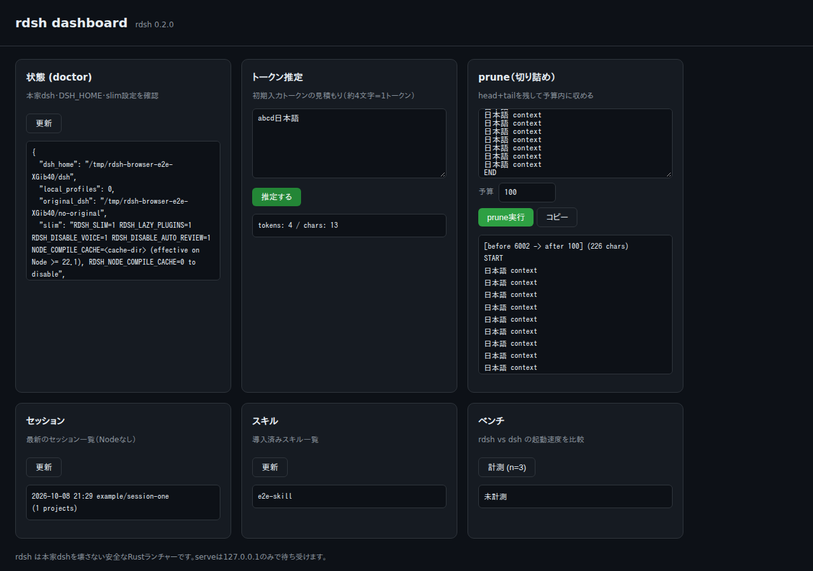
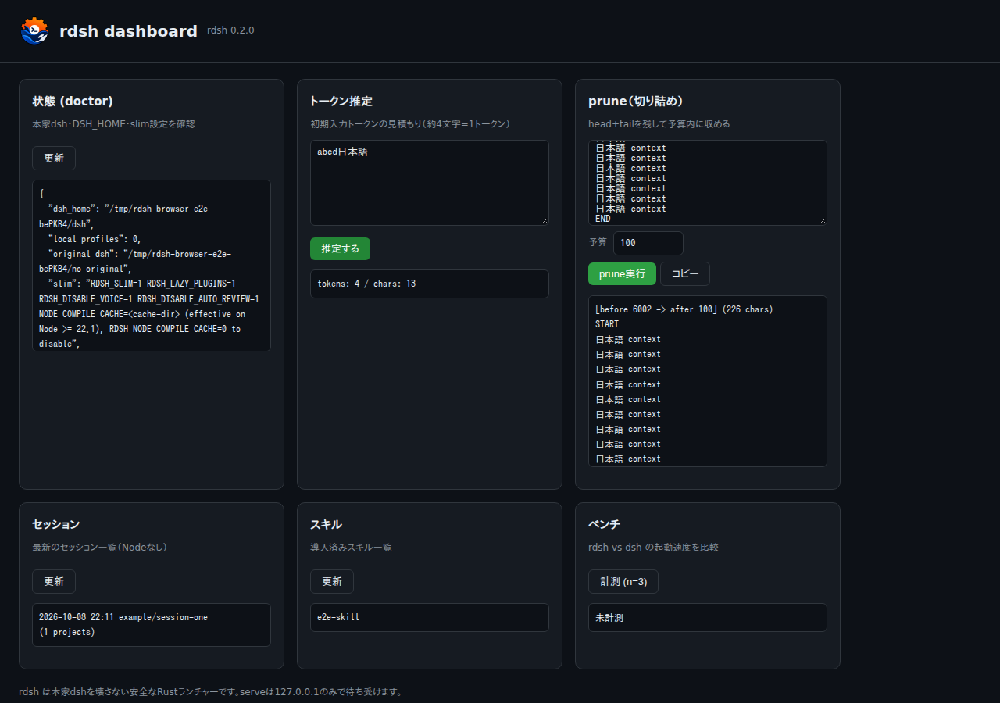

# Common rdsh icon verification

The final supplied rushDSH.png is preserved in [assets/icon.png](../../../assets/icon.png).
README, native serve/setup headers and favicons, the Node Dashboard header and
favicon, the Windows notification-area helper and Windows executable resource
use the same artwork. Icon HTTP routes are fixed assets; API authentication
and host/origin validation are retained.

## Real browser captures

`before.png` is the actual native Dashboard screenshot from source `39c5dd1`
(the HTML/assets match its tested ancestor `76bc60e`). `after.png` is the same
browser flow against the updated native server. Both use isolated dummy homes,
and neither contains a user's desktop or provider credentials. The GIF cycles
these real captures.

| Before | After |
| --- | --- |
|  |  |

## Local checks

- Windows: all 18 tray, launcher and Dashboard checks passed, without skips.
  The real native helper loaded and disposed the new ICO and kept Open/Exit,
  MCP byte streams and separate-project stop behavior.
- Native Rust icon routes: both serve/setup returned exact PNG/SVG/ICO bytes,
  correct binary lengths and MIME types; hostile origins were refused and
  protected APIs remained unauthorized.
- Rust release tests (103), benchmark example tests (7), CLI regression checks
  (53), browser flows (8), Rust 1.85, fmt and clippy passed.
- Windows CI also extracts the compiled executable's actual icon and compares
  its opaque pixels with the common ICO. Final CI results belong to the PR.

The original upload's SHA256 and derived formats are recorded in
[verification.json](verification.json). PNG and ICO generation only resizes and
encodes the supplied artwork. Old release archives and historical evidence are
preserved. A refreshed Windows launcher/build and browser reload are needed
to replace an already running old icon.
