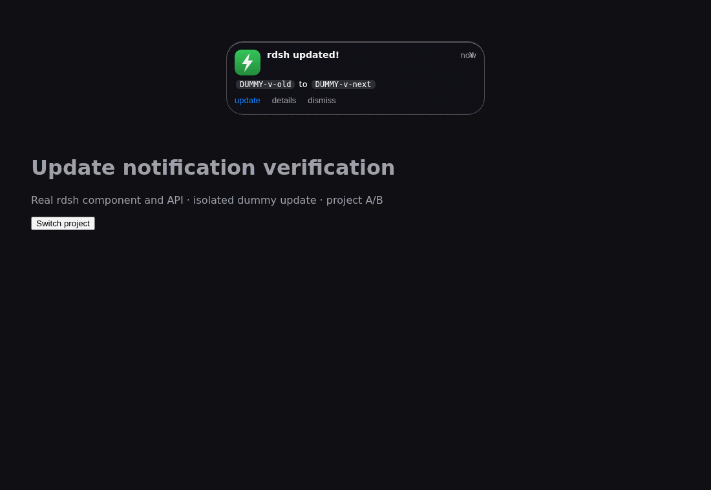

# Update dismissal verification — 2026-10-08

Closing **x** or **dismiss** keeps the same component/target dismissed without a
two-hour expiry. Timestamp changes do not identify a new update. New targets
remain visible, and minimizing does not dismiss them.

The real React component and plugin HTTP handlers were exercised in an isolated
browser host, with a temporary HOME, dummy update versions, authenticated dummy
cookies, two loopback ports and separate browser contexts. This is a component/API
integration test, not a claim that a running production DSH was restarted.

| Before | After |
| --- | --- |
| Same target with a changed `at` reappeared after dismiss and the next poll | Same target remained hidden after close, changed `at`, three hours, project remount and reload |
| Single timestamp record could forget a previously closed target | Independent target records retain both A and B |
| Browser-origin state did not reach another GUI port/browser | Account acknowledgement hid the same target across both ports and contexts |




The GIF uses three actual browser captures from the successful candidate flow:
[visible](visible.png), [dismissed](after.png), and [new target](new-update.png).
It is not a mockup or a recording of a production account.

## Results

- Five browser flows passed without page/console errors; see
  [actual results and source hashes](verification.json).
- Node plugin/settings/banner/model-fence/security/isolation suites: 49 passes,
  zero skipped. API cases cover 401/403 before body reads, missing authentication
  service, bounded/malformed bodies, mismatched targets, idempotent concurrent
  requests, private permissions and planted file/directory links.
- Rust: formatting and release Clippy passed; 103 tests and seven example tests
  passed. CLI regression: 53 checks passed with isolated HOME and a delegate stub.
- Existing setup, native Dashboard and project CLI/MCP browser flows: all three
  passed, including restart and revocation of the old browser key.
- User-authorized existing Muse Spark session reviewed the cause and final
  client/server changes read-only; no blocking finding remained. Review scores:
  correctness 3/3, style 3/3, tests 3/3.

The server stores one private marker per `[kind,to]`, with a SHA256 filename and
exclusive creation. The authenticated endpoint accepts only the current recorded
update target and cannot create arbitrary target histories. Concurrent targets
cannot overwrite each other's markers; `update-state.json` is unchanged.

Same-origin tabs synchronize immediately; other GUI ports/browser contexts see
the account acknowledgement on their next poll (at most 60 seconds) or page load.
All projects/profiles using the same OS user share the records. Separate OS users
do not. Demo closes are browser-local. Both failed server persistence and disabled
browser storage prevent persistence across a full reload; the current page and
project remounts still stay dismissed. Normal restart/reload is needed to load
the new plugin code. No user process was restarted, no real updater was invoked,
and no provider credentials or model calls were used by the regression fixtures.

## Reproduce

```sh
npm ci --prefix tests/e2e
(cd tests/e2e && npx playwright install chromium)
RDSH_UPDATE_E2E_OUTPUT=target/e2e/update-banner npm run test:updates --prefix tests/e2e
node --test tests/update-banner.test.mjs tests/plugin-security.test.mjs
```

For the before/after comparison, save the previous client source to a temporary
file and pass its absolute path through `RDSH_UPDATE_BASELINE_CLIENT`.
