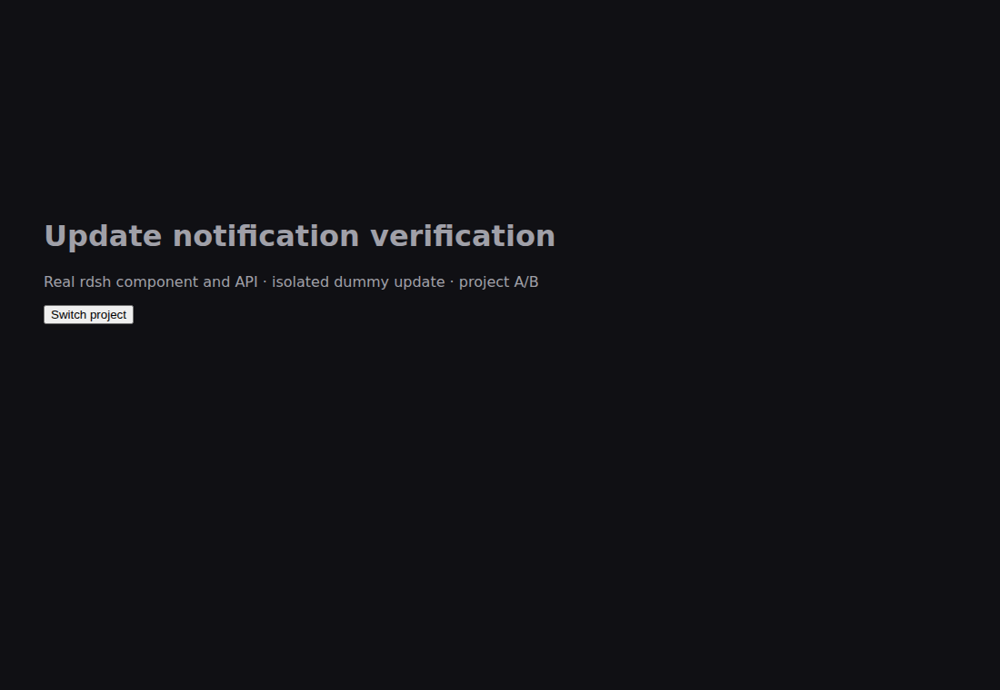
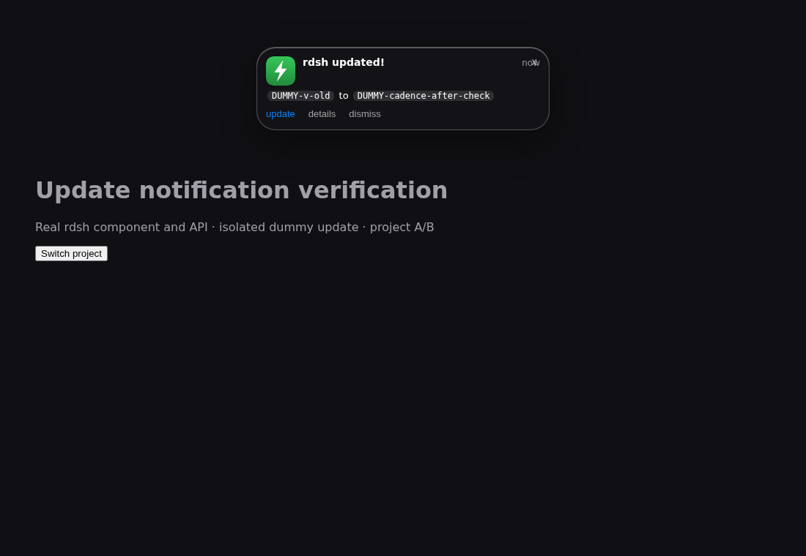
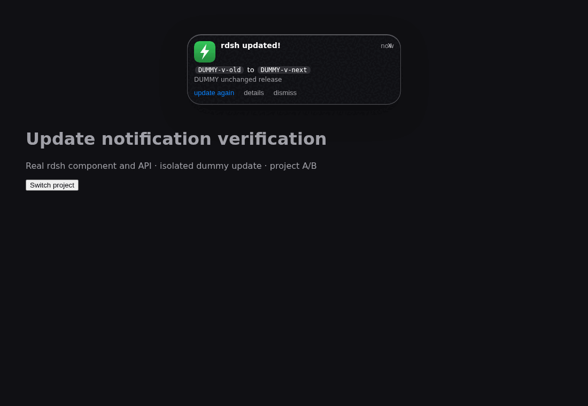

# Stop update-again notification loops

Verified 2026-10-09 with the real React component, authenticated state/close/stream
routes, temporary HOME and local release fixtures. Updater HTTP responses are
mocked in the browser; the shell updater tests use checked `file://` archives and
dummy npm. Production sessions, update state and installed binaries are untouched.

Two defects were reproduced before the fix:

1. Successful updater checks kept the notification open with **update again**.
2. Checking an identical release reinstalled its binary and rewrote the update
   timestamp, which the live client interpreted as another update.

The client now acknowledges only the occurrence present when the request began.
Success closes it; failures stay visible and retryable. A newer update arriving
while the request runs stays visible and receives no stale completion message.
The next two-hour boundary and full page reload still display the update.

The shell updater compares verified payload bytes against the installed binary.
Unchanged bytes preserve the notification record and skip reinstallation. A
changed payload still updates when the version string matches. Checksum failures,
missing checksums and invalid binaries retain the existing refusal behavior.

## Actual captured flow

Before: another successful check still leaves **update again** visible.
After: a successful unchanged check closes the current card.
Then: the original two-hour boundary shows the reminder again.






[Browser report](verification.json): 14 flows, no page or console errors.
The controlled clock advances the two-hour cadence without waiting in real time.
Unit tests also cover HTTP errors, concurrent clicks and an update arriving during
an in-flight request. Shell regressions first failed for an unchanged release
rewriting the dummy notification record, then passed after the comparison fix.

Verification: Node tests 44, Windows notification tests 18, Rust release tests
103 plus example tests 7, CLI checks 55, native browser flows 3, fmt and clippy
passed. One matrix run did not capture the existing fixed-port setup fixture URL;
rerunning the unchanged CLI suite passed all 55 checks, and the independent
browser setup flow also passed.

## Reproduce

```sh
node --test tests/update-banner.test.mjs tests/plugin-security.test.mjs
sh tests/regress.sh
npm run test:updates --prefix tests/e2e
```

Set `RDSH_UPDATE_BASELINE_CLIENT` to the previous client source for the baseline
capture. The browser test never invokes the real updater. Applying the new GUI
code requires its normal reload/restart; running sessions are preserved.
