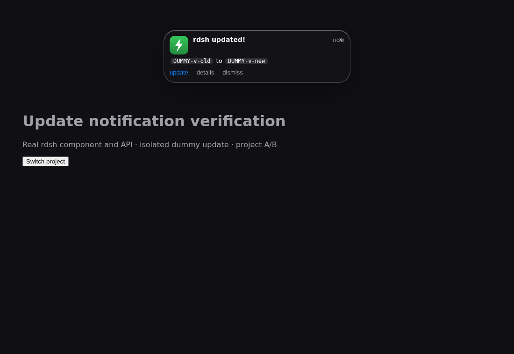
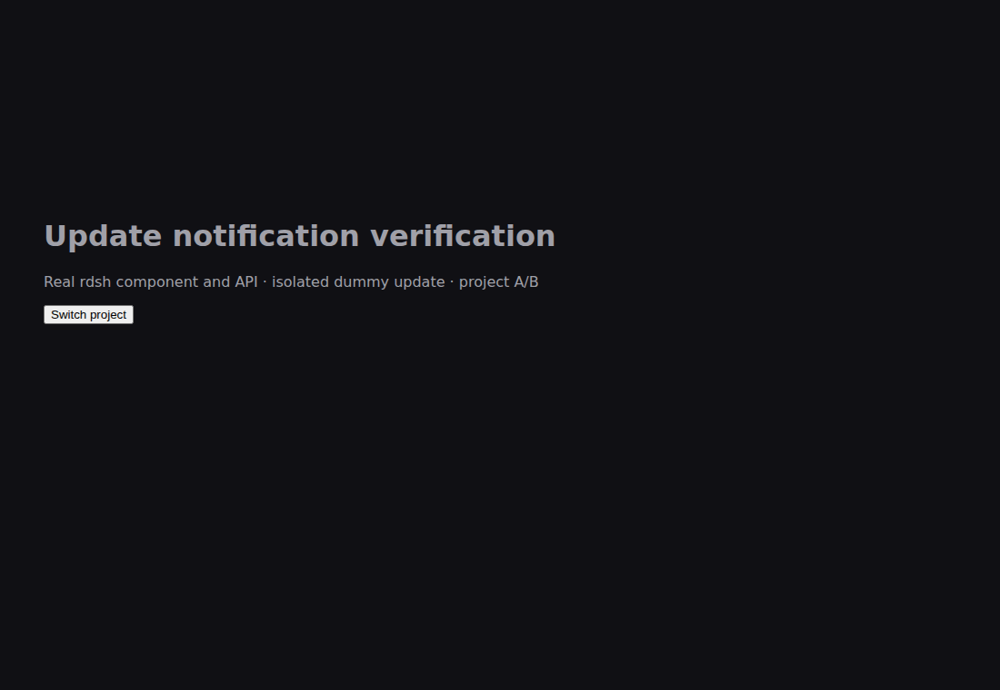

# Live update notifications and two-hour reminders

Verified 2026-10-09 against the real React component and authenticated plugin
routes in two independent loopback hosts. The test uses a temporary HOME, dummy
updates and the browser clock; it never restarts the production GUI or executes
the real updater. This supersedes the permanent-dismissal behavior documented
in the historical `update-dismissal` evidence.

| Trigger | Result |
| --- | --- |
| Actual update recorded while a page is open | Push notification without page reload; 78 ms in this isolated run |
| Dismiss or × | Current occurrence closes; other tabs and GUI ports close too |
| Next two-hour boundary | Notification reappears, measured from the update time |
| Full page reload | Current update appears, including after Dismiss |
| Project remount | Current occurrence remains closed |
| Close/reload midway through a period | Original two-hour cadence continues |
| Stream disconnect | Five-second fallback checks and reconnect; close remains effective for this occurrence |
| Suspended page returns | Catches up to the current period without resetting the schedule |
| Legacy dismissal or unavailable storage | No permanent suppression; close/remount still work |
| Missing session or foreign Origin | State and stream requests rejected before access |

The stream uses filesystem events with a one-second server fallback, bounded
subscribers and backpressure handling. Authentication uses the same DSH transport
as the existing API. Atomic private close records identify an update and period;
old records are never replayed on page load. Updates and historical dismissal
markers remain untouched. New code needs one normal GUI restart/reload to activate;
future notifications then arrive in the open page.

## Real before/after captures

Before: the previous client remained hidden after the update was recorded.
After: the new client received the update without reloading.





[Browser verification report](verification.json): ten flows, no page or console
errors. The latency is a single local observation, not a production guarantee.
The two-hour checks advance a controlled browser clock rather than waiting in
real time. Unit tests also cover stale responses, old close events, stream limits,
cleanup, bounded request bodies, file-link refusal and update-state preservation.

Local verification also passed: Rust release tests (103), example tests (7),
fmt/clippy, CLI regressions (53), Node tests (42), Windows notification tests (16),
and three existing native browser flows. Linux file-link refusal cases run on
Linux; Windows runs the remaining notification checks without skipping tests.

## Reproduce

```sh
node --test tests/update-banner.test.mjs tests/plugin-security.test.mjs
npm ci --prefix tests/e2e
(cd tests/e2e && npx playwright install chromium)
npm run test:updates --prefix tests/e2e
```

Set `RDSH_UPDATE_BASELINE_CLIENT` to a saved previous `client.js` to capture the
baseline too. `RDSH_UPDATE_E2E_OUTPUT` selects an output directory and
`RDSH_CHROME_PATH` can select an existing Chromium executable.
