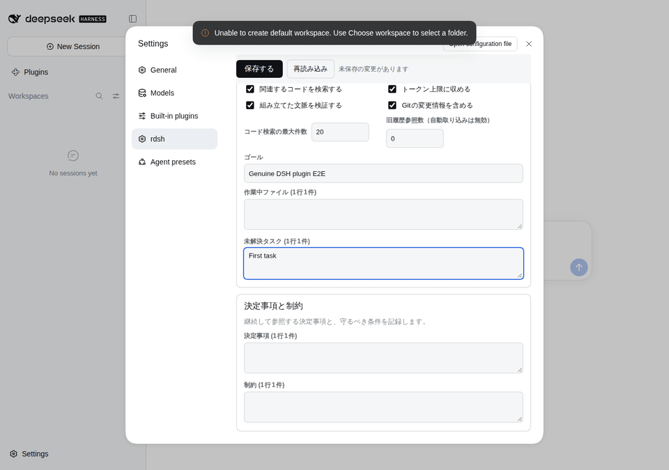

# UX・性能の見直し（2026-10-10）

設定画面、初回接続、ローカル状態画面、プロジェクト画面、CLIの説明と実行経路を見直しました。
改行入力と未保存の編集を保持し、更新で質問欄を作り直さず、検索・ASCIIの切り詰め・単独のバージョン表示を短縮しています。
変更は未リリースの作業ツリーです。公開済みv0.2.0や利用者のインストール先には適用していません。

改修前は `e81782a`、改修後は `codex/ux-performance-review` の作業ツリーです。
正確なベースコミット、バイナリのSHA256・サイズ、変更した実装・テスト・計測スクリプトのSHA256は
[environment.json](environment.json)、検証結果は [verification.json](verification.json) に保存しています。
過去の測定は [BENCHMARKS](../../BENCHMARKS.md) に残しています。

## 使い勝手の変更

- DSH内のrdsh設定：上部に保存・再読み込み・未保存状態を表示し、Discord／起動とコマンド／文脈へ移動できます。保存中は編集を止め、失敗時は下書きを残します。
- 決定事項・制約・作業ファイル・未解決タスク・拒否パターン：入力中の改行をそのまま保持し、保存時に1行1件の配列へ変換します。未解決タスクが消える不具合を修正しました。
- 再読み込みで未保存の変更を破棄する前に確認します。Discordだけの保存では他の下書きと未保存状態を保ちます。タブを閉じる際の確認はブラウザーの制約があります。
- 「スリム出力」を「起動を最適化する」、「保持数」を「表示するセッション数」、「拒否パス」を「拒否する入力パターン」に変更しました。起動環境の調整、表示件数、入力照合の意味に合わせています。
- 文脈の組み立ては実験機能で、CLIへ出力し、DSHへ自動注入しないことを説明しました。セッションの推定値の再計算間隔も設定できます。
- 保存時のUnicode文字数・既定プロファイル200文字・SearXNG URL2000文字・拒否パターン500文字の上限をCLIにそろえました。既存の未知キーとExtrasを保持する保存方式は継続しています。
- 初回設定：接続情報と実際のモデル応答を区別し、既存ログインの明示的な取り込み手順を表示します。APIキーの保存失敗時に入力が残り、Extrasは直前の一覧を読み、他の値を保ちます。
- ローカル状態画面：キーボード用のラベルとフォーカス、処理中・空・エラー・再試行の表示を追加しました。pruneの予算を検証し、入力を変えたら古い結果のコピーを無効にします。
- プロジェクト画面：変化した領域だけを更新し、同時の状態取得をまとめます。非表示タブの定期取得を止め、復帰時に更新します。通信が失敗しても、表示中の期限・観測の鮮度を進め、現在の実行状態は不明と表示します。

## 見直した範囲と既存機能の確認

| 範囲 | 確認・変更の根拠 |
| --- | --- |
| CLI・本家DSHへの委譲・設定の読み書き・guard・context・検索・tokens・prune・compact・履歴・ログ・認証 | Rust 109テスト、CLI 55項目、セキュリティ19テスト、前後出力比較。会話処理は本家DSHのままです。 |
| DSH内設定・旧設定・未知キー・Discord | 設定関連43テストと、本家DSH 0.2.0-rc.2の分離したWebプロファイルで編集・保存・再読み込み・破損・復旧を確認しました。Discordの実アカウントへの公開はしていません。 |
| 初回設定・ローカルHTTP・状態画面 | 実Rustサーバーに対する認証・設定反映・キー保存失敗・キーボード操作・prune入力検証をブラウザーで確認しました。 |
| プロジェクト指標・質問と回答・追加指示・観測期限 | 実CLI／HTTP MCP／SSEのブラウザー操作で保存・再起動・旧キー失効・下書き・フォーカス・カーソル・通信断中の期限切れを確認しました。 |
| 実行管理・CLIアダプター・プリフライト・停止・再試行・チェックポイント・履歴・モデル割当・費用・予算・受入検証 | dashboardの223テストが通過しました。実行権限・入力配送・報告値の処理方式を変更せず、関連する値を描画キャッシュのキーに含めています。 |
| workflowボード・更新通知・インストーラー・リリース整合性 | ソースパッチ／更新通知35テスト、更新通知13ブラウザーフロー、CLIのインストーラーfixture、Python 21テストが通過しました。新しいリリース・タグ・配布物の公開はしていません。 |

これはLinux/WSLでの確認です。Windows固有の6件、Windowsのドライブ表記1件、追加の本家ソースが必要な承認整合性1件はスキップしました。
Electron Desktop、macOS／Windowsネイティブ実行、Tailscale経由の実機、ライブDiscord、新しいモデルタスクの性能は今回の実行対象に含みません。

## 実画面

1280×900と390×844の実ブラウザーで撮影しました。モックではなく、分離したHOME・合成データ・実サーバーの画面です。
本家DSH設定fixtureに表示される初期workspaceの警告は改修前後にある本家側の通知です。
390px幅の設定は項目への移動・入力・保存ができ、横方向にはみ出さないことを確認しました。

| 画面 | 前・PC | 後・PC | 前・スマホ | 後・スマホ |
| --- | --- | --- | --- | --- |
| 初回設定 | [PNG](before/setup-desktop.png) | [PNG](after/setup-desktop.png) | [PNG](before/setup-mobile.png) | [PNG](after/setup-mobile.png) |
| ローカル状態 | [PNG](before/native-desktop.png) | [PNG](after/native-desktop.png) | [PNG](before/native-mobile.png) | [PNG](after/native-mobile.png) |
| プロジェクト | [PNG](before/project-desktop.png) | [PNG](after/project-desktop.png) | [PNG](before/project-mobile.png) | [PNG](after/project-mobile.png) |
| 本家DSH内のrdsh設定 | [PNG](before/settings-desktop.png) | [PNG](after/settings-desktop.png) | [PNG](before/settings-mobile.png) | [PNG](after/settings-mobile.png) |

設定の[起動とコマンド](after/harness-settings-general-mobile.png)、[文脈](after/harness-settings-context-mobile.png)、
設定破損時の[前](before/settings-error.png)／[後](after/settings-error.png)も撮影しました。

改行を入力し、未保存の状態から保存する流れです。実際の3枚のPNGをGIFにしました。



[1行目](after/multiline-first.png)・[改行を含む下書き](after/multiline-draft.png)・[保存後](after/multiline-saved.png)。

## 測定条件

Linux/WSL2 x86_64、AMD Ryzen 7 5700X、利用可能な論理CPU 12、Rust 1.98.1、Node.js 24.16.0、
Chrome 154.0.8037.57で測定しました。正確な版は [environment.json](environment.json) に記録しています。
前後とも `cargo build --release`（opt-level 3、fat LTO、codegen-units 1、strip、panic abort）です。
バイナリサイズは前1,956,552バイト、後1,968,752バイトで、12,200バイト増えています。

CLIは親プロセスの経過時間で、プロセス生成を含みます。4CPUへ固定し、先に他のテストを終え、前後を交互に実行しました。
ウォームアップはnativeが各3回、searchが各2回、extendedが各3回です。nativeとsearchは各21標本、extendedは各15標本です。
全入力は生成したダミーデータで、利用者の履歴・認証情報は使いません。RSSは`/usr/bin/time`による別呼び出しの最大値です。

ブラウザーはCPUを固定せず、1280×900で各5回ウォームアップ後、21標本を交互に採りました。
実際の前後のapp／reports／HTMLを読み込み、タスク100件・質問40件・イベント30件の合成状態を渡します。
計測fixtureだけで定期処理とSSEを止め、`performance.now()`で同期描画から強制レイアウトまでを測ります。
ネットワーク待ち・モデル処理・INPの測定ではありません。SSEや通信断は別の実ブラウザー回帰で確認しています。

以下の「前 / 後」は中央値の比です。1より大きいと短縮、1未満だと長くなっています。
環境やキャッシュで値は変わり、小さい差だけで改善を断定できません。速くなった項目だけを抜粋せず、全条件を掲載しています。

## Native CLI（n=21）

| 条件 | 前・中央値 ms | 後・中央値 ms | 前・p95 ms | 後・p95 ms | 前 / 後 |
| --- | ---: | ---: | ---: | ---: | ---: |
| `--version` | 1.065 | 0.908 | 1.294 | 1.097 | 1.17 |
| tokens / ASCII 10MiB | 7.470 | 7.511 | 9.521 | 9.167 | 0.99 |
| tokens / CJK混在 1,450,000バイト | 3.251 | 3.249 | 3.906 | 3.798 | 1.00 |
| search / 300ファイル・60万行・上限100 | 5.017 | 5.186 | 8.244 | 6.938 | 0.97 |
| prune / ASCII 10MiB・上限4000 | 10.770 | 7.830 | 12.082 | 9.387 | 1.38 |
| prune / CJK混在 1,450,000バイト・上限4000 | 3.756 | 3.732 | 4.290 | 4.500 | 1.01 |
| sessions --tokens / 20件・各1MiB・既知サイズ・温まったキャッシュ | 3.422 | 3.488 | 3.651 | 3.735 | 0.98 |

[全標本・入力量・最大RSS・出力ハッシュ](native.json)。全7条件の標準出力が一致しました。
ASCII・日本語・絵文字・結合文字・NUL・CRLFと17予算の102組は標準出力と標準エラーの一致も確認しました。

同じ環境の本家DSH `--version` は中央値73.018ms、p95 79.983ms、最大RSS 68,259,840バイトでした。
rdshのバージョン表示は中央値0.908ms、最大RSS 2,752,512バイトです。前後rdshの最大RSSは3,805,184→2,752,512バイトでした。
本家との比較はバージョン表示に限り、会話やモデル実行の速度を表しません。
`dsh`として呼ぶ場合は本家へ渡し、単独のネイティブ `--version`／`-V`だけ解析処理を短縮します。
[複合引数・無効UTF-8・ヘルプの互換性](version-compatibility.json)。説明文の改善によるヘルプの差は意図した変更です。

## ファイル検索（n=21）

| 条件（上限10） | 前・中央値 ms | 後・中央値 ms | 前 / 後 |
| --- | ---: | ---: | ---: |
| 高密度一致 / 160ファイル・96万行 | 2.390 | 2.460 | 0.97 |
| 該当なし / 160ファイル・96万行 | 8.998 | 5.390 | 1.67 |
| 該当なし / 1500ファイル・各40行 | 5.224 | 5.135 | 1.02 |
| 深い階層 / 800ファイル・各40行・深さ5 | 6.557 | 6.831 | 0.96 |
| 一致と不一致の混在 / 160ファイル・各1000行 | 2.509 | 2.215 | 1.13 |

[全標本・最大RSS・前後出力・64互換条件](search.json)。上限、並列処理の閾値、CRLF、切り詰め、UTF-8、隠しファイル、リンクなどの組合せで出力とエラーが一致しました。
長い非一致ファイルの行分割を省ける場合に短縮しました。高密度一致や深い階層などには小幅な悪化もあります。

## Extended Rust（n=15）

| 条件 | 前・中央値 ms | 後・中央値 ms | 前・p95 ms | 後・p95 ms | 前 / 後 |
| --- | ---: | ---: | ---: | ---: | ---: |
| compact_jsonl_1mib | 2.537 | 2.641 | 3.392 | 3.415 | 0.96 |
| search_at_least_32 | 1.763 | 1.885 | 2.887 | 2.786 | 0.94 |
| search_under_32 | 1.373 | 1.390 | 1.711 | 1.887 | 0.99 |
| sessions_cache_disabled | 5.063 | 5.158 | 10.819 | 6.315 | 0.98 |
| sessions_cache_warm | 3.201 | 3.277 | 3.485 | 3.564 | 0.98 |
| sessions_known_frame_first_cache_miss | 5.318 | 5.486 | 5.733 | 6.203 | 0.97 |
| sessions_streaming_zstd_no_content_size | 23.338 | 22.987 | 25.292 | 26.978 | 1.02 |

7条件の前後出力が一致しました。以下は追記・並行実行・起動済みRustサーバーへのHTTPの追加測定です。
増える履歴は各回の正しさも確認しました。HTTPはTCP接続から応答までで、ブラウザーを含みません。

| 条件 | 前・中央値 ms | 後・中央値 ms | 前・p95 ms | 後・p95 ms | 前 / 後 |
| --- | ---: | ---: | ---: | ---: | ---: |
| 追記しながら増えるストリーム | 10.334 | 10.866 | 18.175 | 12.268 | 0.95 |
| 4プロセスの並行実行 | 7.648 | 8.297 | 8.320 | 9.696 | 0.92 |
| HTTP / version | 0.534 | 0.538 | 0.691 | 0.694 | 0.99 |
| HTTP / tokens_40kib | 0.604 | 0.526 | 0.682 | 0.809 | 1.15 |
| HTTP / prune_40kib | 0.621 | 0.580 | 0.863 | 0.696 | 1.07 |

[全標本・生成条件・検証結果・バイナリ指紋](extended.json)。このextended実行の`original_dsh`は未指定（null）です。
本家の起動比較は上のnative結果に記録しています。

## ブラウザー描画（n=21）

| 条件 | 前・中央値 ms | 後・中央値 ms | 前・p95 ms | 後・p95 ms | 前 / 後 |
| --- | ---: | ---: | ---: | ---: | ---: |
| idle | 30.500 | 0.400 | 52.600 | 0.500 | 76.25 |
| metrics_changed | 28.900 | 3.300 | 35.400 | 3.900 | 8.76 |

[生データ・前後ソースSHA256・DOM変更数・下書き検証](rendering.json)。
表示するタスク・質問・イベント、入力中の下書き、フォーカス、選択範囲の一致を確認しました。
監視した領域のDOM変更レコードは同じ状態で4→0、指標変更で4→1でした。
質問のtextareaは改修後の全標本で同じノードを保ちました。改修前はノードを作り直していました。
同期描画の短縮率を、アプリ全体や実際のモデル応答の短縮率として扱うことはできません。

## 検証記録

| コマンド・対象 | 結果 |
| --- | --- |
| fmt / clippy（全targets、警告をエラー） | PASS |
| `cargo test --release` | 109 PASS |
| `benchmark_extended` / `benchmark_models`のテスト | 2 / 5 PASS |
| 設定・プラグイン安全性・Discord・モデルfence | 43 PASS |
| dashboard全体（委譲されたLinux cgroupのscope内） | 223 PASS、Windows専用6 SKIP |
| `sh tests/regress.sh` | 55項目 PASS |
| 実Rust・Node・MCP・ブラウザー | 5フロー PASS、想定外のpage errorなし |
| 本家DSHの設定画面 | PASS、390px操作・横はみ出しなし |
| セキュリティ・隔離・runtime・アイコン・本家承認 | 19 PASS、追加ソース要件1 SKIP |
| workflow source patch・更新通知 | 35 PASS、Windows表記1 SKIP |
| 更新通知の実React／2つの認証済みhost | 13フロー PASS |
| リリース資産・metadataのPythonテスト | 21 PASS |

[コマンド一覧と判定](verification.json)、[ログ](logs/)、[ブラウザー](browser-results.json)、
[本家DSH設定](harness-results.json)、[更新通知](update-banner-verification.json)。
キー保存HTTP500・状態取得HTTP503・壊れた設定HTTP400は意図的なエラーfixtureです。
ブラウザーの期待するエラーは、注入したパス・HTTPコード・件数を照合し、それ以外を許可しません。

Muse Spark 1.3 Contributor / Xhighに、利用者が指定したDSHの「codex連携用の場所です」で2回レビューを依頼しました。
改行保存・説明の正確さ・描画・エラー許容の指摘を反映しました。
Discord部分保存の基準、再起動後のrevision、プロジェクト別キャッシュについては現在のコードと回帰検証を照合し、
不具合を再現せず、既存の保存・旧キー失効・project別ロードの仕組みを維持しています。
私用チャットの画面、launch URLの鍵、会話本文はこの記録に含めていません。
最終差分レビューはCorrectness 3／Style 3／Tests 3（各0〜3）、blockingなしです。

## 再現する

リポジトリのルートで実行します。比較用checkoutは独立した一時ディレクトリに作ります。

```sh
base_dir="$(mktemp -d)/rustdsh-before"
git worktree add --detach "$base_dir" e81782a
cargo build --release --manifest-path "$base_dir/Cargo.toml"
cargo build --release
cargo build --release --example benchmark_extended

python3 scripts/benchmark.py --bin target/release/rdsh \
  --baseline "$base_dir/target/release/rdsh" --cpus 4 --n 21 \
  --dsh /path/to/original/dsh --output /tmp/rdsh-native.json
python3 scripts/benchmark-search.py "$base_dir/target/release/rdsh" \
  target/release/rdsh --cpus 4 --n 21 --output /tmp/rdsh-search.json

python3 - "$base_dir/target/release/rdsh" <<'PYBENCH'
import os, subprocess, sys
os.sched_setaffinity(0, sorted(os.sched_getaffinity(0))[:4])
subprocess.run([
    './target/release/examples/benchmark_extended',
    '--bin', './target/release/rdsh', '--baseline', sys.argv[1],
    '--n', '15', '--output', '/tmp/rdsh-extended.json',
], check=True)
PYBENCH

npm ci --prefix dashboard
npm ci --prefix tests/e2e
RDSH_CHROME_PATH=/path/to/chrome node tests/e2e/benchmark-dashboard.mjs \
  --baseline-ref e81782a --n 21 --output /tmp/rdsh-rendering.json
```

`--dsh`は任意で、指定時は本家の`--version`だけを測定します。
このCPU固定の手順はLinux用です。4CPUを選べない環境では条件を変更し、記録してください。
測定後、比較用checkoutを不要と確認したら `git worktree remove "$base_dir"` で片付けられます。

機能確認は [CONTRIBUTING](../../../CONTRIBUTING.md) と [ブラウザーテスト](../../../tests/e2e/README.md) の手順を使います。
このWSLではcgroupの委譲が必要なため、dashboardを作業ディレクトリにして
`systemd-run --user --scope -p Delegate=yes --quiet npm test` を実行しました。
通常の失敗を見逃すための設定変更や、本家実行の隔離を外す変更は行っていません。
