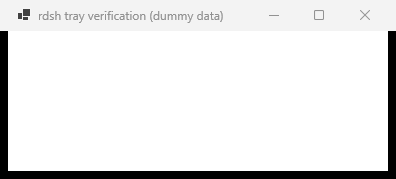

# Windows notification-area tray verification

The native Windows launcher starts `project` / `harness` without a resident
console window. Each notification-area icon has Open / 開く and Exit / 終了.
The direct Node CLI keeps foreground behavior unless `--tray` is requested;
`--no-tray` keeps the installed launcher in terminal mode.

## Actual UI captures

These PNGs capture the running WinForms controls using Windows `PrintWindow`.
The before/after images show an owned neutral test window before opening and
following closing of the **new** menu; they are menu-flow states, not a fabricated
old application screenshot. `menu.png` captures the real production menu.
The GIF cycles these captures. No user's desktop or credentials are included.

| Before menu | Native menu | After menu |
| --- | --- | --- |
|  |  |  |

## Behavior and checks

Before: the Windows `project` / `harness` launcher occupied its console and
printed the local server URL and Ctrl-C instructions. After: it waits for the
server and real tray to be ready, prints the notification-area message, and
returns. Other subcommands, MCP streams, and explicit terminal mode stay foreground.

Native Windows Dashboard suite: **195 passed after installation without lifecycle scripts**. The latest focused tray/launcher
checks: **13 passed**, including real PowerShell forwarding and MCP stdin/stdout,
quoted/Unicode project paths, duplicate startup rejection, separate project
survival, actual menu callbacks, NotifyIcon disposal, failed stop retry and lost
warning-pipe handling. Linux runs the portable checks and skips native UI cases.
The real Windows installer also passed with an apostrophe/metacharacter destination
and a changed PATH after installation. It installs without package lifecycle
scripts and verifies the native prebuilt rather than skipping ownership checks.

Rust **103**, examples **7**, CLI regression **53**, browser **8 flows**, Markdown
lint and the installed dependency audit also passed. Source hashes are recorded
in [verification.json](verification.json); these checks make no model calls.

Exit calls the captured server's existing scoped close operation. Its managed
Harness must have verified empty descendants before shutdown completes.
Unverified stop leaves the server available and the tray can warn/retry.
No process-name kill or runtime-file PID kill was added. The helper receives no
provider credentials, browser URLs or administrator keys. Browser opening retains
the existing URL-handler behavior documented in [Dashboard README](../../../dashboard/README.md).

A Linux-installed Koffi tree cannot run the Windows kernel ownership tests. The
full Windows check used a dedicated Windows copy and Windows `npm ci` instead
of weakening the ownership checks or changing the shared development dependencies.
The original checkout's concurrent Codex-bridge and release-note edits are excluded.

## Independent current-source review

Source `2adb5d14771c6a8e5fc57700ee73cc01a9460c77` was checked on native
Windows using Node v22.23.3 and PowerShell 7. The 13 tray/launcher tests all
passed, without skips, including the actual menu, NotifyIcon disposal, MCP
streams, quoted project paths and preservation of a separate project.

The actual installer passed in an isolated directory containing spaces,
an apostrophe, an ampersand and Japanese characters. Its WSL native package
now uses the loaded Windows Koffi version rather than a hardcoded `3.1.1`.
The current `3.1.1` dependencies were verified first. A separate integration
fixture then used PR #198's package/lock from
`0cfb8df27a46471614a24ab7afdf33c69d0d473d`: the actual Windows native module
and coinstalled `@koromix/koffi-linux-x64` were both `3.3.2`. No models,
paid APIs, real project servers or user installation directories were used.

The review also repairs the BSD HTTP test socket and remaps historical
repository links to their transfer destination in CI. The earlier full-suite
counts and source hashes above remain the original checks; this section records
the narrower rerun and concrete dependency integration separately.
