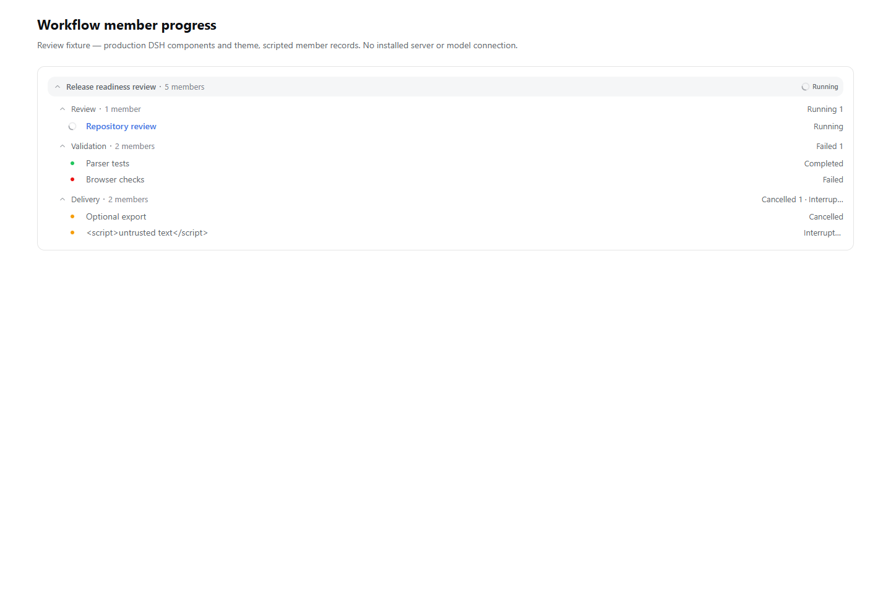
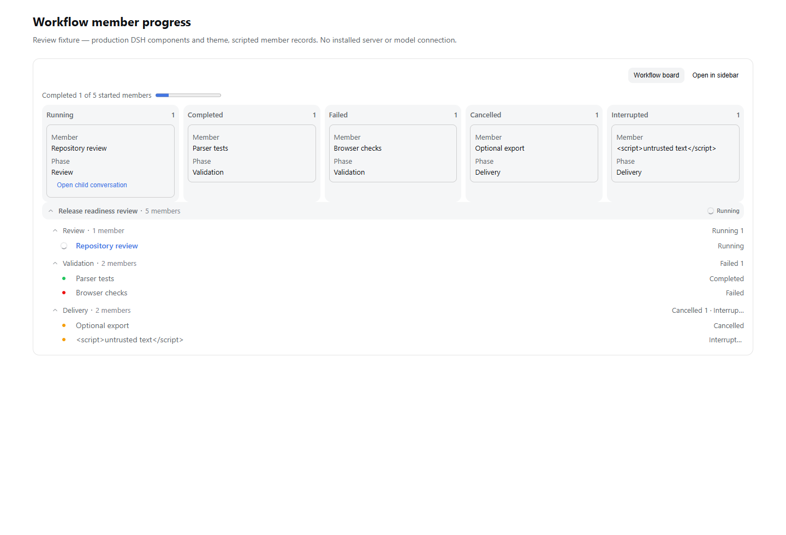
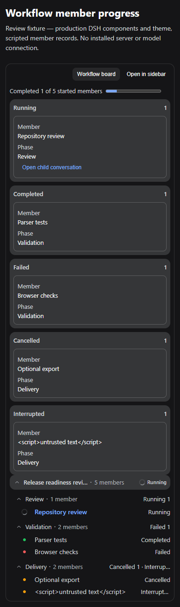
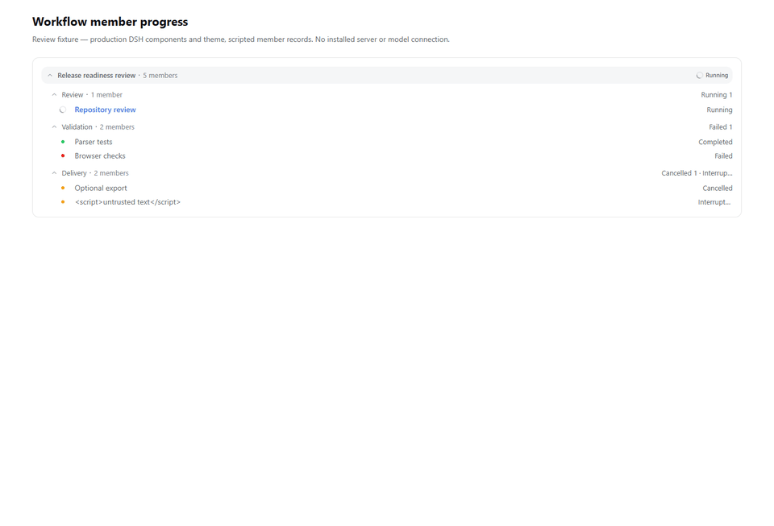

# Workflow board source preparation: merge preparation

Runtime/tool review source: rustdsh `c2fc097e96b71e7ed2fbbed4d0525678361949d0`, including main `f2a7dc6b2850a6f0c0e1ea1b53494b12cd2e1221`. The DSH patch bytes remain unchanged: base `f97c0438fb1608bbc4c08c88a27344249795ea22`, board `7bd9ac31c23fe369d1fa9a6849869f04967d6ee5`.

## Addressed review findings

- CLI entry detection resolves the script identity, including directory links and Windows junctions.
- Git's ownership protection is retained. `core.fsmonitor` is disabled for preparation, and optional index refresh writes are disabled.
- Applying the checksummed patch ignores user whitespace preferences instead of modifying or falsely rejecting its bytes.
- All 18 output Git blob IDs are pinned from the board commit's tree and checked. Reverse-applicable edits outside a patch hunk, other tracked/untracked edits and differing staged contents cannot report `already-applied`.
- Tests compare the actual patch header/numstat with the manifest and exercise write failure, post-write verification failure and preservation of user edits.
- Node 22 is the documented/tested minimum. Both languages describe the shared UI reducer changes and the limitation that active source-linked installations cannot be detected.
- Main's attributes and CI changes are integrated, the patch remains byte-preserved, and the toolkit is documented separately from installable plugins.

## Independent checks

| Check | Result |
| --- | --- |
| Windows / Node 22 source preparation | 16 passed; Unix fsmonitor case skipped |
| Linux / Node 24 source preparation | 16 passed; Windows drive-letter case skipped |
| Real isolated DSH base checkout | `ready` → `applied` → `already-applied`; all 18 files independently matched the board's Git blobs |
| Patched DSH focused tests | 49 passed in two files |
| rustdsh fmt / release Clippy | Passed; warnings denied |
| rustdsh Rust release tests | 66 passed |
| Plugin security / dashboard | 13 / 8 passed |
| CLI / settings / context regression | 42 / 20 / 21 passed |
| Windows Chrome fixture | Four viewport/theme combinations passed; no page errors or horizontal overflow |

Chrome renders the actual before/after DSH components, actual UI primitives and production theme with five scripted started-member records. It verifies completed counts changing from 1/5 to 2/5, direct-child navigation, Escape focus and selected sidebar run identity. The scoped [browser results](workflow-board-browser.json) contain no credentials or local paths.

Before (base source):

After (board source):

390px / production dark theme:

The GIF uses the actual captured before, opened-board and live-update frames:

## Scope

This verifies the source preparation toolkit and production-component fixture. It does not install or adopt the patched DSH, run a real model/server workflow, or claim the complete DSH build/GUI/web gates passed. UI projection rules change; the execution engine and persisted events do not. See [tool instructions](../../plugins/workflow-board/README.md).

## Current-main integration, 2026-10-08

Integrated main `98abc67d7e5c5d3f2a5321d9a56adb6a83ff93e2` at
`06917972415152cdfc7dc1610b365d340ea06ed0`. Native Rust sources are identical
to that main commit. The CI merge retains both the source-patch checks and
main's new native E2E, benchmark examples and browser/security jobs.
Removed main's tracked host-specific `dashboard/node_modules` symlink.

The current Windows Node 22 source-patch run passed 16 tests with one Unix-only
case skipped. The pinned 18-file patch, manifest and DSH components remain
unchanged from the 49 focused DSH tests and four browser captures above.
Those earlier DSH/browser results are not described as newly rerun checks.
The latest head's shared platform/security CI must pass before merge.
